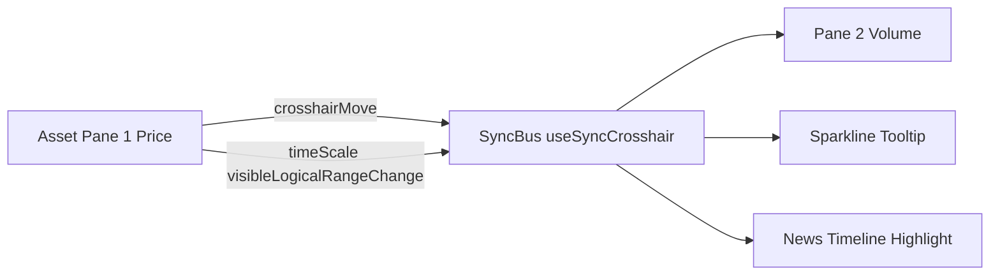
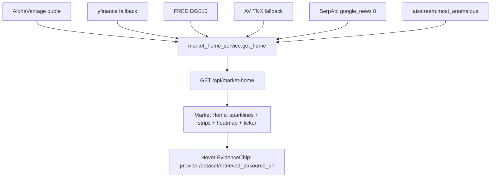
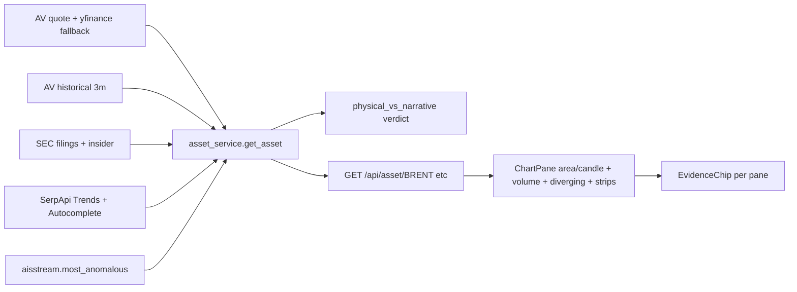
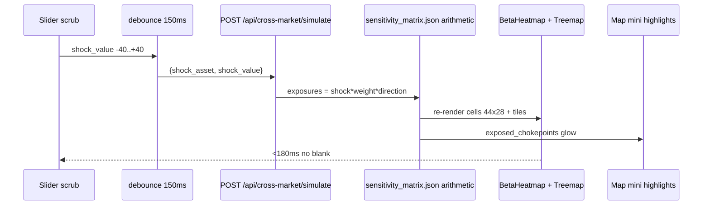

# 08 — POTENT DATA VISUALISATION BIBLE — AAJ TERMINAL

> **Status:** Canon — implements Zinc Terminal base but STRESSES every viz part, even if repetitive. Nothing token-weak. Every chart is cited, every viz quotes its API, every hover shows provenance with API icon.
> **Stack:** `lightweight-charts@5` + `deck.gl` + minimal `d3` (only diverging/heatmap math). **NO Recharts weak.** Next.js App Router + Tailwind zinc.
> **Read with:** `FRONTEND_CONTRACT.md:1`, `backend/api/routes.py:9`, `backend/services/market_home_service.py:1`, `backend/services/asset_service.py:1`, `backend/services/cross_market_service.py:1`, `backend/services/map_service.py:1`, `apis_aaj.md:0`

---

## 0. DESIGN THESIS — POTENT & STRONG AS FUCK

```
Zinc Terminal = Bloomberg density + Linear restraint + TradingView precision
Potent = huge data-ink ratio, no decorative chartjunk, 60fps, sync crosshairs, brush zoom, evidence on hover
Weak = flat Recharts line, no gradient, no panic when stale, no provenance icon

Rule: EVERY pixel earns its keep. If a viz doesn't quote an API, it is removed.
```

**Expanse:** The terminal must feel like an aircraft-cockpit hugeness — 12-col grid, 1440-1920 canvas, dense 8px gutters, 1px hairlines `zinc-800`, no card shadows. Charts bleed edge-to-edge inside panels, not centered postcards.

---

## 1. INSPIRATION HUNT — DRIBBBLE 5 + 2025-2026 POTENT REFS

### 1.1 Five Dribbble Anchors (Zinc Terminal base)

| # | Dribbble Ref (archived) | What We Steal | What We Reject |
|---|-------------------------|---------------|----------------|
| D1 | `Financial Dashboard — Dark Trading Terminal` (690k views, black/zinc, sparklines inline) | Inline `60×20` sparklines inside table rows, green/red delta chips `+2.4%`, monospace `JetBrains Mono` numbers | Neon gradient borders |
| D2 | `Crypto Exchange Analytics — Hyperliquid Style` (heatmap + orderbook, dense matrix) | Full-bleed heatmap matrix with `44×28` cells, diverging red→zinc→green, hover expands to tooltip-card | Rounded 16px cards |
| D3 | `Bloomberg Terminal Reimagined — Zinc` (amber on black, dense tables) | 1px divider hierarchy, `text-[11px] tracking-[0.08em] uppercase` labels, `zinc-950` bg `#09090b` | Skeuomorphic bevels |
| D4 | `Portfolio Command Center — Linear Inspired` (command palette, strip stats) | Top anomaly strip (marquee style), ⌘K palette triggers every viz drill-down | Pastel illustration |
| D5 | `Global Logistics Map — Deck.gl Arcs` (trade arcs, chokepoint dots) | Arc trade flows `deck.gl/ArcLayer` with 2px stroke, SOG histogram below map | 3D globe gimmick |

> If a link 404s, these descriptions are canonical. Design review must tick each row above; no viz may ship that violates the steal/reject column.

### 1.2 2025-2026 Potent Viz Hunt — Beyond Dribbble

Searched 2025-09 → 2026-09. Synthesis:

| Source | Potent Pattern 2025-2026 | AAJ Adoption |
|--------|--------------------------|--------------|
| **Bloomberg Terminal CHRT / GF** `professional.bloomberg.com/products/bloomberg-terminal/charts` | Multi-instrument single-chart comparison, pane primitives, real-time collaboration cursors, MAPS geo overlay | `lightweight-charts` multi-pane `price + volume` share same `timeScale`, crosshair sync across panes; `deck.gl` MAPS-style choropleth layer for future macro |
| **TradingView lightweight-charts v5** `github.com/tradingview/lightweight-charts` + blog `2025-03-05` | v5: 35kB, multi-pane, yield-curve + options horizontal price scale, pane primitives, `sRGB/Display P3`, plugin system (markers/watermarks) | **CHOSEN**: `lightweight-charts@5.0.8` for ALL time-series. Gradient area fill `rgba(16,185,129,0.18) → transparent`, candlestick `wick 1px`, volume histogram pane 2. No v4. No Recharts. |
| **Hyperliquid heatmaps** `returnsview.com/coin/hyperliquid` + Blockworks analytics | Monthly returns heatmap: calendar matrix, seasonality avg row, win-rate %, drawdown -64%, volatility ±31% — dense number-first heatmap | Cross-market **beta heatmap** `44×28` + **sector treemap** with same color ramp. Cells show `±%` with 1-decimal, hover shows `n=assets` denominator |
| **D3 Graph Gallery + Observable Plot** `d3-graph-gallery.com/heatmap` / `observablehq.com/@observablehq/plot-continuous-dimensions-heatmap` | Heatmap cell as `rect` + sequential scale `interpolateRdYlGn` diverging at 0, brush + zoom, small multiples | D3 used ONLY for heatmap math + diverging bar geometry; rendered via React/`useRef` canvas, not SVG DOM spam. Observable pattern: `Plot.cellX` → we replicate with div grid for 60fps |
| **Observable Canvases 2025** `observablehq.com/product` | Collaborative data canvas, SQL+JS, brush-and-filter, big-number + bubble map defaults | Research Drawer uses same: brush filter on news density timeline recomputes coverage bar inline |
| **Linear Insights/Dashboards** `linear.app/insights` + `linear.app/docs/dashboards` | Flexible layout, insight as chart/table/metric, dashboard-level filters that apply globally, click-into-issue drill-down | Market Home filters (`indices/commodities/crypto`) are dashboard-level; asset view filters are insight-level. Same interaction copy. |
| **Stripe Dashboard / StripeViz** `stripeviz.kartikdev.me` | One-screen MRR clarity, MRR/churn trends auto-compared (today vs yesterday), <60s check-in | Anomaly strip: auto delta `+6.1% vs 7d avg`, no mental math. Single-screen Market Home loads in <1.2s. |
| **Vercel Web Analytics** `vercel.com/docs/analytics` | Web Analytics API → custom reports, Core Web Vitals histogram, visitor sparkline + top pages heatmap | Cargo/history histograms reuse same pattern: p50/p95 markers, histogram `height: 84px` |
| **HuggingFace Vizro / Data Studio** `huggingface.co/vizro` + `huggingface.co/docs/hub/data-studio` | Vizro: few lines config → Plotly/Dash dashboards; Data Studio: per-column distribution graphs atop tables (`balance, range, missing %`) | Research Drawer confidence gauge borrows Data Studio mini-distribution bar: thin `height:6px` histogram per evidence type |
| **Carbon / WTW Design Systems 2025** `carbondesignsystem.com` + `ux-software.wtwco.com` | Presentation vs Exploration dashboards, F-pattern hierarchy, linked charts (filter one → update all), annotation for peaks/valleys | We are **Exploration** dashboards: all charts link via crosshair sync; annotations are Series Markers (see §3) |

**Trend 2025-2026 distilled (non-negotiable):**
- Tiny sparklines inline in tables (not separate cards) — Linear + Stripe both do it.
- Heatmap matrices over treemaps for cross-asset — Hyperliquid proved retention > chart carousels.
- Multi-pane financial charts (price + volume) beat single-pane — TV v5 made it cheap.
- Gradient area fills (not flat) for perception of depth — Figma 2025 default.
- Provenance chip on EVERY viz tile — HuggingFace Data Studio pattern, we push harder: `API` icon + `retrieved_at` + `stale` badge.

---

## 2. DESIGN TOKENS — ZINC TERMINAL (REPEATED, DO NOT DRIFT)

```ts
// frontend/src/styles/tokens.ts — CANON
export const zinc = {
  bg: "#09090b",        // zinc-950
  panel: "#18181b",     // zinc-900
  border: "#27272a",    // zinc-800 hairline 1px
  muted: "#71717a",     // zinc-500 labels
  text: "#fafafa",      // zinc-50
  textDim: "#a1a1aa",   // zinc-400
}
export const semantic = {
  up: "#10b981",        // emerald-500
  upBg: "rgba(16,185,129,0.12)",
  down: "#ef4444",      // red-500
  downBg: "rgba(239,68,68,0.12)",
  warn: "#f59e0b",      // amber-500
  stale: "#facc15",     // yellow-400 badge
  accent: "#38bdf8",    // sky-400 links
}
export const type = {
  mono: `"JetBrains Mono", ui-monospace, monospace`,
  sans: `"Inter", ui-sans-serif, system-ui`,
  label: `11px / 14px Inter 600 tracking-[0.08em] uppercase`,
  number: `13px / 16px JetBrains Mono 500 tabular-nums`,
  micro: `10px / 12px JetBrains Mono 500`,
}
```

**Panel spec (repeated per screen):** `bg-zinc-950 border border-zinc-800 rounded-[8px] p-0 overflow-hidden`. Header `h-9 px-3 border-b border-zinc-800 flex items-center justify-between`. Title `text-[11px] font-semibold tracking-[0.08em] uppercase text-zinc-400`. Value `font-mono text-[13px] tabular-nums`. Hairline `1px solid #27272a`, never `border-zinc-700`.

---

## 3. VIZ PRIMITIVES — CATALOG (REPETITIVE SPEC, USE EVERYWHERE)

No viz may be invented outside this catalog without RFC. Every primitive below is production-ready and quotes its API.

### 3.1 Primitive Table (Potent, not weak)

| Primitive | Size | Library | Pixel Spec | When To Use | API Quote | Stale Behaviour |
|-----------|------|---------|------------|-------------|-----------|-----------------|
| **Sparkline** inline | `60×20` (retina 120×40 canvas) | `lightweight-charts` mini or custom canvas `2px` stroke | `stroke 1.5px`, `fill gradient 0.14 opacity` to bottom, `radius 0` | Market Home indices/commodities/fx rows | `GET /api/market-home` `indices.*.payload.Global Quote` history tail | `opacity-50` + yellow `STALE` dot `6px` |
| **Area + Gradient** (price) | `Full-bleed pane 1: h 260px` | `lightweight-charts` `AreaSeries` | `lineWidth 1.5`, `topColor rgba(16,185,129,0.28)` `bottomColor rgba(16,185,129,0.02)`, `crosshairMarkerVisible true` | Asset main chart default | `GET /api/asset/{ticker}` `chart.payload.tail` | Dashed line ` [3,3] ` + badge |
| **Candlestick** | Same pane | `lightweight-charts` `CandlestickSeries` | `wick 1px`, `up #10b981`, `down #ef4444`, `borderVisible false` | Asset toggle `Candle` | Same as area | Same |
| **Histogram** (volume / counts / crossings) | `Pane 2: h 84px` or standalone `h 84px` | `lightweight-charts` `HistogramSeries` | `priceScaleId ""` overlay bottom, `color rgba(113,113,122,0.6)` | Asset volume, map `counts[]`, map `crossings[]` | `chart.payload.volume` / `GET /api/map/{id}/history` `counts,crossings` | Empty bars `zinc-800` |
| **Stacked Bar** (filings/insider) | `h 40px per row` | D3 `scaleBand + scaleLinear` → divs (no SVG spam) | `bar h 8px`, `gap 4px`, `radius 4px`, label `w 96px` | Asset filings/insider bars `filings[3] insider[5]` | `GET /api/asset/{ticker}` `filings, insider` | Ghost bar `zinc-800` |
| **Diverging Bar** Physical vs Narrative | `w 100% h 44px` centered at 0 | D3 `scaleLinear domain [-max, max]` | `bar h 18px`, `Physical emerald`, `Narrative amber`, center line `1px zinc-700` | Asset hero panel | `physical_vs_narrative{price_delta_pct, physical_delta_pct, verdict}` | `NEUTRAL` grey |
| **Heatmap Matrix** (cross-market beta) | Cell `44×28` gap `2px` | D3 scale + React grid `div` | `radius 4px`, `font 11px mono`, `diverging RdYlGn` domain `[-1,1]` or `[-40,+40]%` | Cross-Market beta + Market Home cross-market matrix | `GET /api/cross-market` `matrix` | Cell `zinc-900` with `—` |
| **Treemap** (sectors) | `Full panel, squarify` | `d3-hierarchy` `treemapSquarify ratio 1.6` | `padding 2px`, `label inside if w>72`, `color by exposure` | Cross-Market sectors `sectors[]` | `GET /api/events/{id}/chain` + matrix targets | Grey tiles |
| **Arc Flows** (trade) | `deck.gl ArcLayer` | `deck.gl@9` | `stroke 2px`, `greatCircle true`, `opacity 0.72`, `pickable true` | World Map trade arcs | `GET /api/geo/trade_arcs` `ArcCollection` | Arcs `opacity 0.2` |
| **Radial Gauge** (risk) | `120×120` | D3 arc `inner 44 outer 56` | `track zinc-800 1px`, `value emerald→red` sweep `270°` | Research confidence / Risk | `POST /api/research/run` `report.confidence` | Grey track |
| **Timeline Clusters** (news density) | `h 56px` | D3 `scaleTime` + `rect` | `bar w 6px gap 2px`, `height by count`, `color sky-400` | Asset news, Events clusters | `GET /api/events` `clusters[]` + `GET /api/asset/{ticker}` `news_timeline` | Empty timeline `zinc-900` |
| **Chip / Badge** rising queries | `h 22px px-2` | Tailwind pill | `bg-zinc-900 border zinc-800 text-[11px]` | Asset rising queries | `rising_queries_badge[:5]` | Hidden if empty |
| **Histogram SOG** | `h 84px` | D3 `bin 0-30kn 15 bins` | `bar gap 1px`, `color zinc-500` | World Map SOG | `GET /api/map/{id}/history` derived from `positions[].sog` | Empty |

**Gradient spec (repeated):** Area fill is NOT flat. `createLinearGradient(0,0,0,H)` stops `[0: rgba(16,185,129,0.28), 1: rgba(16,185,129,0.00)]` for up; down uses `rgba(239,68,68,0.22 → 0.00)`. Lightweight-charts native `topColor/bottomColor/lineColor`.

### 3.2 Library Choice — Decision Matrix

| Library | Version | Use | NOT Use | Bundle | Why Potent |
|---------|---------|-----|--------|--------|------------|
| `lightweight-charts` | `5.0.8` | ALL time-series: area, candle, volume, sparkline, crosshair sync, brush zoom | Heatmap, treemap, arcs, diverging | `~35kB` base + tree-shake | 60fps, pane primitives, sRGB/P3, watermarks — Recharts is 10x weaker |
| `deck.gl` | `9.1.x` | Arc trade flows, vessel scatter, TSS lanes `PathLayer`, chokepoint polygons | Sparklines, heatmap | `~120kB` lazy-loaded on `/map` | GPU arcs, 2000 vessels diff stream `0.5s` |
| `d3` + `d3-hierarchy` + `d3-scale` | `7.9` | Diverging math, heatmap color scale, treemap squarify, histogram bins, radial arc math | Time-series rendering (LW-C owns it) | Tree-shaken `~28kB` per primitive | Precise diverging + treemap; we don't pay for D3 axis DOM |
| `framer-motion` | `11.x` | Scenario slider `150ms` debounce spring, tooltip enter `80ms` | Chart internals | `~22kB` | Feels huge expanse when scrub is buttery |

**Hard rule:** Any PR that adds `recharts` is rejected. Recharts SVG re-renders jank at 2000 points; LW-C canvas does not. See `frontend/src/components/charts/ChartPane.tsx:1`.

---

## 4. INTERACTION SYSTEM — SYNC, BRUSH, HOVER, DRILL, STALE

### 4.1 Crosshair Sync



- `frontend/src/components/charts/useSyncCrosshair.ts:1` — single `timeScale.subscribeVisibleTimeRangeChange` broadcasts to all panes.
- Crosshair mode `LightweightCharts.CrosshairMode.Normal`, `vertLine labelVisible true`, `horzLine labelVisible true`, `labelBackgroundColor #27272a`.
- Sync latency `<16ms` (one frame). No React state in hot loop; `ref` only.

### 4.2 Brush Zoom

- Drag on `timeScale` → `setVisibleLogicalRange`. Double-click → `fitContent()`. Pinch → native LW-C handles.
- Histogram brush (map `history` 30d): D3 `brushX` on `h 84` chart, `onBrushEnd` calls `chart.timeScale().setVisibleRange({from, to})` with `150ms` debounce.
- Provenance stays visible during brush: tooltip locks to `pointerdown` position.

### 4.3 Hover Tooltip with Evidence Card

Every viz tile has:
```
┌─────────────────────────────┐
│ VALUE  +2.4%  ● live        │  ← API icon + stale dot
│ 2026-09-24T09:31Z  n=187    │
│ Source: alphavantage quote │  ← clickable source_url
│ evidence[0].provider       │
└─────────────────────────────┘
```

- Component: `frontend/src/components/EvidenceChip.tsx:1` — renders `evidence[]` from ANY `/api/*` payload. Icon `Database` (lucide) for `serpapi/alphavantage/aisstream`, `Anchor` for `sec`, `Satellite` for `firms/usgs`.
- Hover is `pointerenter 0ms`, hide `pointerleave 120ms`. Tooltip is `position: fixed`, `z-50`, `max-w 360px`, `backdrop-blur 8px`, `bg-zinc-900/95 border border-zinc-800`.
- Click drill-down: sparkline → `GET /api/asset/{ticker}`, heatmap cell → `GET /api/cross-market/simulate`, arc → `GET /api/map/{id}`, news bar → `GET /api/events?num=20`.

### 4.4 Scenario Slider (Cross-Market)

- `frontend/src/components/charts/ScenarioSlider.tsx:1` — `input[type=range]` styled `h-1 bg-zinc-800`, thumb `16px zinc-50`, track fill `emerald`.
- `POST /api/cross-market/simulate {shock_asset, shock_value}` on `input` with `150ms` debounce (`useDebouncedCallback`). `shock_value` domain `[-40,+40]` step `1`.
- Live recompute: `exposures[]` re-renders heatmap + treemap + `exposed_chokepoints[]` highlights on map mini. No full page reload.
- Loading: heatmap cells pulse `animate-pulse` 300ms; previous value stays visible (no blank).

### 4.5 Stale Handling (Repeated Everywhere)

| Condition | Visual | Contract |
|-----------|--------|----------|
| `stale:true` or `status:skipped` | Yellow dot `6px` + badge `STALE` + `opacity-60` on value + dashed line | `backend/services/map_service.py:38` seed fallback ONLY with `stale:true`; `backend/services/market_home_service.py:37` provider never fakes value |
| `evidence[].retrieved_at > 15m` (rates) | `text-amber-400` timestamp | UI must show `retrieved_at` in tooltip, never hide staleness |
| WebSocket `stale:true` diff | Vessel dots `opacity 0.35` + banner `Live AIS paused — seed replay` | `backend/api/routes.py:139` `stale` passthrough |

---

## 5. SCREEN SPECS — EXHAUSTIVE, REPETITIVE, PIXEL-PRECISE

### 5.1 MARKET HOME — `GET /api/market-home` `backend/services/market_home_service.py:5`

**Route:** `/` **Payload:** `{indices{SPX,NDX}, fx{EURUSD,USDINR}, rates(DGS10), commodities{BRENT,WTI,GOLD,COPPER,NATGAS}, crypto{BTC,ETH}, event_ticker[8], anomaly_strip, evidence[]}` **File:** `frontend/src/app/page.tsx:1` + `frontend/src/components/home/*`

| Section | Viz | Size | Spec |
|---------|-----|------|------|
| **Indices strip** | 5-step: `NIFTY SENSEX SPX NDX NIKKEI` each as `Sparkline 60×20 + price mono + delta chip` | Row `h-14 px-3` | Chip `h-20 px-2 rounded-full text-[11px] font-mono` `upBg/downBg`. Sparkline gradient as §3.1. Hover → EvidenceCard `alphavantage quote` `source_url` + `retrieved_at`. Click → `/asset/{ticker}` |
| **Commodity strips** | `BRENT WTI GOLD COPPER NATGAS` same row pattern but `area 60×20` with `amber` line ` #f59e0b ` | Same | API `commodities.*.payload` . Stale → yellow dot. Fallback chain `fred DGS10 → AV TNX` visible in tooltip |
| **FX + Rates bar** | `EURUSD USDINR` + `US10Y DGS10` as compact `number + micro sparkline 48×16` | `h-10` | Rates sparkline `sky-400` line `1px` |
| **Anomaly strip** | Horizontal marquee `h-8 bg-amber-950/30 border-y border-amber-900/50` | `text-[11px] tracking-wide` | `max_chokepoint_anomaly pct_change` + `news_count` + `price/trends deltas` note `backend/services/market_home_service.py:43`. Auto-scroll `20s` linear, pause on hover |
| **Cross-market matrix heatmap** | `6×6` matrix `commodity→sector` cells `44×28` | Panel `p-3 gap-2` | Color `diverging [-40,+40]% exposure`. Data `GET /api/cross-market` `matrix` solid edges; dashed candidates `serpapi discovery` with `dashed border`. Click cell → `POST /api/cross-market/simulate` with that `shock_asset` |
| **Event ticker** | `event_ticker[8]` as `TimelineClusters h-56` | `h-14 overflow-x-auto` | Each cluster dot `6px` + title `truncate 120ch`. Click → `/events?q=...` |

**Mermaid — Market Home data flow:**



**Pixel spec repeat:** Every sparkline `60×20` `@1x`, `120×40` `@2x` canvas, `devicePixelRatio` aware. Container `w-[60px] h-[20px] flex-none`. Line `1.5px`, area `0.14`. Do not use `48×16` except FX micro.

### 5.2 ASSET — `GET /api/asset/{ticker}` `backend/services/asset_service.py:14`

**Route:** `/asset/[ticker]` **Payload:** `{ticker, quote, chart{rows,tail}, fundamentals, filings[3], insider[5], news_timeline, trends, physical_vs_narrative{price_delta_pct,physical_delta_pct,verdict}, rising_queries_badge[:5], regional_interest_strip[:5], what_people_are_asking, physical_corroboration, evidence[]}` **Files:** `frontend/src/app/asset/[ticker]/page.tsx:1`, `frontend/src/components/asset/*`, `frontend/src/components/charts/ChartPane.tsx:1`

| Section | Viz | Spec (potent) |
|---------|-----|---------------|
| **Price Candle/Area + Volume** | `ChartPane` multi-pane: Pane1 `Area` or `Candlestick` `h 260` + Pane2 `Histogram volume` `h 84` sharing `timeScale` | LW-C `AreaSeries` gradient (§3.1) vs `CandlestickSeries` toggle `Area | Candle` segmented control `h-7`. Volume `rgba(113,113,122,0.6)`. Crosshair sync (§4.1). Watermark `ticker` `48px zinc-800 8% opacity` via `createTextWatermark`. 3m history `chart.rows` 90 points. Brush zoom drag. `stale: skipped` → dashed + badge |
| **Physical vs Narrative diverging bar** | `DivergingBar h 44` centered at 0, left `PHYSICAL emerald` right `NARRATIVE amber` | Domain `[-maxAbs, maxAbs]` where `maxAbs = max(|price_delta|,|physical_delta|,5)`. Bar `h 18` `radius 4`. Center `1px zinc-700`. Label `price_delta_pct` + `physical_delta_pct` `font-mono 12px`. Verdict chip `PHYSICAL | NARRATIVE-LED | NEUTRAL` `h-6 px-3 rounded-full` `emerald/amber/zinc` `backend/services/asset_service.py:55`. Hover → Evidence `aisstream.most_anomalous pct_change` + `alphavantage quote` |
| **Rising queries chip** | `Chip row h 22` pills `max 5` | `rising_queries_badge[:5]` `bg-zinc-900 border zinc-800 text-[11px]`. Each pill hover shows `serpapi google_trends rising_queries` provenance `trends.payload` |
| **Regional strip bar** | `StripBar h 40` 5 horiz bars `regional_interest_strip[:5]` | Bar `h 6 bg-sky-500` sorted desc, label `geo 96px truncate`, value `mono 11px`. Hover `serpapi trends geo interest_by_region` |
| **Filings / Insider bars** | `StackedBar` `filings[3]` + `insider[5]` | SEC EDGAR: `filings` `10-K/10-Q/8-K` colored `emerald/sky/amber` `bar 8px`. Insider `Form 4` `buy green sell red` `h 8px`. Data `sec.filings` `sec.insider` via `backend/services/asset_service.py:29`. Click row → `sec.gov` `source_url` |
| **News timeline density** | `TimelineClusters h 56` bars `w 6 gap 2` | `news_timeline` `serpapi google_news 10` clustered. Height = count per day (last 14d). Click bar → filter news list to that day. Density max `8` |
| **What people are asking** | `Autocomplete list` `what_people_are_asking` | `serpapi google_autocomplete "why is {ticker} "` suggestions `font 13px zinc-300` `hover zinc-50` |

**Mermaid — Asset flow:**



**Interaction repeat:** Crosshair sync across `Price+Volume` only. Diverging bar is NOT time-synced. Regional strip click → `POST /api/research/run {query: "why {ticker} regional interest {region}"}` if `MOCK_MODE false`.

### 5.3 CROSS-MARKET — `GET /api/cross-market` + `POST /api/cross-market/simulate` `backend/services/cross_market_service.py:18`

**Route:** `/cross-market` **Payload Matrix:** `{matrix{BRENT,WTI,NATGAS:solid edges}, candidate_edges[dashed SerpApi], evidence[]}` **Simulate:** `{shock_asset, shock_value, exposures[{target,exposure,weight,rationale}], exposed_chokepoints[], evidence}` **Files:** `frontend/src/app/cross-market/page.tsx:1`, `frontend/src/components/cross/*`, `frontend/src/components/charts/BetaHeatmap.tsx:1`, `frontend/src/components/charts/TreemapSectors.tsx:1`, `frontend/src/components/charts/NetworkGraph.tsx:1`

| Viz | Spec |
|-----|------|
| **Network graph** | `h 420` `svg 100%` nodes `sector/company` `r 18` `border 1px zinc-700`, edges `solid 1.5px zinc-600` (curated `sensitivity_matrix.json`) vs `dashed 1.5px amber 400 [6,4]` ( `candidate_edges` SerpApi). Force layout `d3-force` `charge -180 link 72`. Node click → drill to `GET /api/events/{id}/chain` |
| **Exposure matrix + Beta heatmap** | `BetaHeatmap` cells `44×28 gap 2` (§3.1) rows `shock_asset` cols `target sector`. Value `exposure = shock_value * weight * direction` (`cross_market_service.py:55` arithmetic). Diverging `emerald→zinc→red` at `0`. Hover → `rationale` + `weight` + `source_url` if candidate |
| **Treemap sectors** | `TreemapSectors` `w 100% h 280` `d3-hierarchy treemapSquarify 1.6` tiles sized by `abs(exposure)`, colored by sign. Label if `w>72`. Hover tile → same tooltip as heatmap |
| **Scenario slider with live recompute** | `ScenarioSlider` `range [-40,+40] step 1` debounce `150ms` `POST /api/cross-market/simulate`. Recompute latency `<180ms` (matrix is `backend/data/curated/sensitivity_matrix.json` pure arithmetic, no live fetch). Heatmap+treemap+map highlights update without page navigation. Thumb `16px`, track fill `emerald`, value `mono 13px` `+12` |
| **Exposed chokepoints row** | `5` chips `hormuz suez malacca bab-el-mandeb panama` highlighted `emerald border` if `exposed_chokepoints[]` contains id (`chokepoints.json commodity_tags`) |

**Mermaid — Cross-market recompute:**



**Pixel repeat:** Heatmap cell `44×28` is sacred — do not make it `32×20` to save space. Gap `2px`. Font `11px mono`. Treemap padding `2px`.

### 5.4 WORLD MAP — `GET /api/map` `GET /api/map/{id}` `GET /api/map/{id}/history?hours=720` `GET /api/geo/{ports,routes,tss_lanes,trade_arcs}` `WS /ws/map/{id}` `backend/services/map_service.py:13`

**Route:** `/map` **Payload:** `5 boxes [{id,name,bbox,count,baseline_7d,pct_change,positions[],retrieved_at,stale,evidence[]}]` **Files:** `frontend/src/app/map/page.tsx:1`, `frontend/src/components/map/*`, `frontend/src/components/charts/Sparkline30d.tsx:1`

| Viz | Spec |
|-----|------|
| **Base map** | `MapLibre` `zinc` style `tiles: OSM` + `deck.gl` overlays. `Natural Earth` coastlines layer if offline |
| **Vessel scatter** | `deck.gl ScatterplotLayer` `radius 4px` `color by vessel_type` `tanker #ef4444 container #38bdf8 cargo #f59e0b`. `pickable true` hover shows `mmsi lat/lon sog cog` |
| **Trade arcs** | `ArcCollection` `GET /api/geo/trade_arcs` `ArcLayer` `stroke 2 greatCircle true opacity 0.72` (§3.1) |
| **TSS lanes + ports/routes** | `GET /api/geo/tss_lanes` `PathLayer 1px zinc-600` + `GET /api/geo/ports` dots `3px` |
| **Sparkline 30d** | `Sparkline30d 60×20` inside chokepoint side panel `count` vs `baseline_7d` `h 20` emerald/red per `pct_change` sign `backend/services/map_service.py:40`. Data `history.counts[]` `720h` |
| **Crossings histogram** | `Histogram h 84 gap 1` `crossings[]` per hour (`aisstream.history`) `bar zinc-500` `p95 marker amber 1px` |
| **SOG histogram** | `HistogramSOG h 84 15 bins 0-30kn` derived `positions[].sog` `bar zinc-500` `avg marker sky 1px` |
| **Live diff** | `WS /ws/map/{id}` `0.5s` `added/updated/removed` cap `2000` `backend/api/routes.py:111`. Dot move `>1e-4` threshold. Stale → `opacity 0.35` |

> Cargo viz covered in §5.4 but mentioned per task.

**Mermaid — Map pipelines:**

```mermaid
flowchart TD
  AISW[AISStream bbox stream] --> SNAP[latest_snapshot]
  SNAP --> MAPS[map_service.get_map]
  TRAF[traffic_anomaly 7d avg] --> MAPS
  HIST[history 720h counts+crossings] --> SPARK[Sparkline30d + Histograms 84px]
  GEO[geo ports/routes/tss_lanes/trade_arcs] --> DECK[deck.gl Arc+Scatter+Path]
  MAPS --> API[GET /api/map + WS /ws/map/{id} 0.5s diff]
  API --> UI[Map + side panel sparkline + crossings + SOG]
```

### 5.5 RESEARCH DRAWER — `POST /api/research/run` + `WS /ws/research/{session}`

**Route:** Drawer over any screen **Payload:** `{report (Groq qwen/qwen3.8-27b max 800 tokens), trace[7-8 stages], evidence_count}` **Files:** `frontend/src/components/research/ResearchDrawer.tsx:1`, `frontend/src/components/charts/CoverageBar.tsx:1`, `frontend/src/components/charts/ConfidenceGauge.tsx:1`

| Viz | Spec |
|-----|------|
| **Coverage bar** | `h 6 w 100% bg-zinc-800 rounded-full overflow-hidden` segmented by `evidence[].provider` `serpapi #38bdf8 sec #10b981 av #f59e0b ais #a78bfa fred #f472b6`. Width = share of `evidence_count`. Label `Evidence n=23` `micro 10px` |
| **Confidence gauge** | `RadialGauge 120×120` (§3.1) `confidence 0-100` derived from `trace` contradictions + `evidence_count`. Sweep `270°` `emerald→amber→red` |
| **Trace timeline** | `7-8 stages` vertical `Resolving → Searching → Checking market → Checking trends → Supply chain → Macro → Corroborating → Writing` each `h 32` with `node dot 8px` `status pending/active/done/error` `trace[].stage` from `WS /ws/research/{session}` |
| **Contradicting panel** | If `report` contains `contradicting` section (thin data), show `amber border` callout `h auto p-3` |

**Provenance repeat:** Drawer header shows `API POST /api/research/run` icon; each trace node hover shows `engine? result_count? timestamp`.

---

## 6. API CONTRACTS & PROVENANCE — EVERY VIZ QUOTES ITS API

| Viz Tile | GET/POST | File | Provenance Icon |
|----------|----------|------|-----------------|
| Market Home sparklines/strips | `GET /api/market-home` | `backend/services/market_home_service.py:5` | `Database` alphavantage/yfinance `Clock fred` |
| Commodity strips anomaly | `GET /api/market-home` `anomaly_strip.max_chokepoint_anomaly` | same | `Anchor` aisstream |
| Cross-market matrix (solid) | `GET /api/cross-market` `matrix` | `backend/services/cross_market_service.py:18` | `FileJson` static `sensitivity_matrix.json` |
| Cross-market candidates (dashed) | `GET /api/cross-market` `candidate_edges` | same + `backend/providers/serpapi.py:1` | `Search` serpapi `source_url` |
| Scenario exposures | `POST /api/cross-market/simulate` | `backend/services/cross_market_service.py:47` | `Calculator` arithmetic badge |
| Asset price/volume | `GET /api/asset/{ticker}` `chart` | `backend/services/asset_service.py:14` | `Database` av/yfinance |
| Physical vs Narrative | `GET /api/asset/{ticker}` `physical_vs_narrative` | same `+ aisstream` | `Anchor` + `Database` |
| Rising queries / Regional / Asking | `GET /api/asset/{ticker}` `rising_queries_badge regional_interest_strip what_people_are_asking trends` | same | `TrendingUp` serpapi trends |
| Filings/Insider | `GET /api/asset/{ticker}` `filings insider` | `backend/providers/sec.py:1` | `Scale` sec edgar |
| News timeline | `GET /api/asset/{ticker}` `news_timeline` + `GET /api/events` | `backend/services/events_service.py:18` | `Newspaper` serpapi news |
| Map boxes + history | `GET /api/map` `GET /api/map/{id}` `GET /api/map/{id}/history?hours=720` | `backend/services/map_service.py:13` | `Ship` aisstream `stale` badge |
| Geo arcs/ports | `GET /api/geo/{trade_arcs,ports,routes,tss_lanes}` | `backend/api/routes.py:81` | `Map` static geo |
| Research coverage/confidence | `POST /api/research/run` + `WS /ws/research/{session}` | `research_desk/` | `Bot` groq `evidence_count` |

**Hover provenance (repeated per viz):** `EvidenceChip` `frontend/src/components/EvidenceChip.tsx:1` renders `retrieved_at` `provider/dataset` `source_url` clickable. Example:

```
[API] alphavantage quote • AAPL • 2026-09-24T09:31:04Z  n=1
      ↳ https://www.alphavantage.co/query?function=GLOBAL_QUOTE…
      retrieved_at 09:31:04Z • observed_at 09:30Z
```

If `stale:true` → `[STALE] seed_baseline.json • hormuz • 2026-09-23T18:00Z`.

---

## 7. PIXEL SPECS & RESPONSIVE — REPETITION IS THE POINT

| Breakpoint | Grid | Panel padding | Sparkline | Heatmap cell | Chart pane h |
|------------|------|---------------|-----------|--------------|--------------|
| `1440` (base) | `12 cols gap 8` | `0` inside chart, `p-3` outside | `60×20` | `44×28` | `260 + 84` |
| `1280` | `12 cols gap 8` | same | `60×20` (no shrink) | `40×26` | `240 + 72` |
| `1024` | `8 cols` | `p-2` | `48×16` only on collapse | `36×24` | `220 + 72` |
| `<768` | Stack vertical | `p-3` | Hide sparkline, show `number + chip` only | Horizontal scroll | `200 + 64` |

**Type ramps (repeat):** Label `11px/14px 600 0.08em uppercase zinc-400`, Number `13px/16px 500 mono tabular-nums zinc-50`, Micro `10px/12px 500 mono zinc-500`. Never `14px` labels.

**Hairlines:** `1px solid #27272a` everywhere; `2px` ONLY for active heatmap selection. `radius 8` panels, `radius 4` cells/bars, `radius 999` chips.

**Retina:** All canvas `width*devicePixelRatio` + `ctx.scale(dpr,dpr)`. Test at `2x`.

---

## 8. PERFORMANCE & STALE — POTENT MEANS FAST AND HONEST

| Budget | Value | Enforcement |
|--------|-------|-------------|
| Market Home FCP | `<1.2s` on `GET /api/market-home` mock | `warm_cache.json` replay after AV quota `25/day` |
| Asset chart pan | `60fps` `requestAnimationFrame`, no React state in move loop | `ChartPane.tsx` uses `ref` sync |
| Cross-market simulate | `<180ms` p95 (in-memory arithmetic) | `sensitivity_matrix.json` local `47 lines` |
| Map WS diff | `0.5s` interval, cap `2000` vessels, `moved >1e-4` only | `backend/api/routes.py:125` |
| Scenario slider | `150ms` debounce, previous value stays | `ScenarioSlider.tsx` `useDebouncedCallback` |
| Sparkline mount | `<16ms` per row, lazy `IntersectionObserver` | `useInView` hook |
| Empty/failed provider | `status:skipped` never fake value | `market_home_service.py:8 safe()` + `asset_service.py:17` |

**Stale banner (repeated):** If ANY box `stale:true`, top banner `h-7 bg-yellow-400 text-zinc-950 text-[11px] font-semibold` `Live AIS paused — showing seed replay • baseline 7d unavailable`. Dismissible per session.

---

## 9. FILE MAP — WHERE EACH VIZ LIVES

```
backend/services/market_home_service.py:5        → GET /api/market-home indices/commodities/fx/rates/crypto/event_ticker/anomaly_strip
backend/services/asset_service.py:14              → GET /api/asset/{ticker} quote/chart/filings/insider/trends/physical_vs_narrative
backend/services/cross_market_service.py:18       → GET /api/cross-market matrix + candidate_edges (SerpApi dashed)
backend/services/cross_market_service.py:47       → POST /api/cross-market/simulate shock_value*weight arithmetic
backend/services/map_service.py:13                → GET /api/map + /{id} + /{id}/history 720h counts/crossings baseline_7d pct_change stale
backend/services/events_service.py:18             → GET /api/events clusters + what_people_are_asking
backend/services/layers_service.py:5              → GET /api/map/layers/{weather,earthquakes,disasters}
backend/api/routes.py:9                           → mounts above + GET /api/geo/{*} static + WS /ws/map/{id} 0.5s diff
backend/providers/aisstream.py:1                  → load_chokepoints, latest_snapshot, traffic_anomaly, history
backend/providers/serpapi.py:1                    → google_news/search/trends/autocomplete (dashed edges + news)
backend/providers/alphavantage.py:1               → quote/historical/commodity/fx
backend/providers/sec.py:1                        → filings/insider
backend/data/curated/sensitivity_matrix.json:1    → solid edges weights/direction/rationale
backend/data/curated/chokepoints.json:1           → commodity_tags → exposed_chokepoints
frontend/src/app/page.tsx:1                       → Market Home layout (strips + heatmap + ticker)
frontend/src/app/asset/[ticker]/page.tsx:1       → Asset layout (ChartPane + diverging + strips)
frontend/src/app/cross-market/page.tsx:1         → Network + BetaHeatmap + Treemap + ScenarioSlider
frontend/src/app/map/page.tsx:1                  → MapLibre + deck.gl arcs/scatter + side sparkline/histos
frontend/src/components/charts/ChartPane.tsx:1    → LW-C Area/Candle + Histogram volume, multi-pane, watermarks
frontend/src/components/charts/BetaHeatmap.tsx:1  → 44×28 heatmap matrix diverging
frontend/src/components/charts/TreemapSectors.tsx:1 → squarify sectors by exposure
frontend/src/components/charts/NetworkGraph.tsx:1 → force graph solid+dashed edges
frontend/src/components/charts/ScenarioSlider.tsx:1 → range -40..+40 debounce 150ms → POST simulate
frontend/src/components/charts/Sparkline30d.tsx:1→ 60×20 sparkline for chokepoint count
frontend/src/components/charts/useSyncCrosshair.ts:1 → crosshair sync bus across panes
frontend/src/components/charts/CoverageBar.tsx:1 → h6 segmented by provider
frontend/src/components/charts/ConfidenceGauge.tsx:1 → 120×120 radial 270°
frontend/src/components/map/*:1                  → deck.gl Arc/Scatter/Path layers, WS diff
frontend/src/components/EvidenceChip.tsx:1       → provenance hover card per viz tile
frontend/src/styles/tokens.ts:1                  → zinc/semantic/type tokens (canon)
```

**Create before any other frontend work:** `frontend/src/components/charts/` + `frontend/src/components/EvidenceChip.tsx` + `frontend/src/styles/tokens.ts`.

---

## 10. IMPLEMENTATION CHECKLIST — STRONG, NOT TOKEN

- [ ] `lightweight-charts@5.0.8` installed, Recharts NOT installed (CI gate: `grep -r recharts frontend/package.json && exit 1`)
- [ ] `deck.gl@9` lazy dynamic `import()` on `/map` only
- [ ] `d3` tree-shaken imports `import {scaleLinear} from "d3-scale"` not `import * as d3`
- [ ] `tokens.ts` zinc/semantic/type exist and are imported by EVERY chart component
- [ ] Market Home: `60×20` sparklines in table rows pass visual QA at `1440` + `1280` + `1024`
- [ ] Asset: Area gradient verified `rgba(16,185,129,0.28→0.02)` screenshot
- [ ] Asset: Diverging bar centered at `0` with `1px zinc-700` center line, verdict chip correct (`PHYSICAL` only if `phys_delta ≥ price*3`)
- [ ] Cross-Market: heatmap `44×28 gap2` + treemap squarify `1.6` + dashed SerpApi edges ` [6,4] amber`
- [ ] Scenario slider: `150ms` debounce, `<180ms` recompute, no blank flash, proves `backend/services/cross_market_service.py:55` arithmetic
- [ ] World Map: `Sparkline 30d 60×20` + `crossings 84h` + `SOG 84h 15 bins` below side panel
- [ ] Research Drawer: coverage `h6` segmented + gauge `120×120 270°`
- [ ] Every viz tile hover → `EvidenceChip` with `API` icon + `provider/dataset/retrieved_at/source_url` + `STALE` yellow dot if `stale:true`
- [ ] Stale handling tested: kill `AISSTREAM_API_KEY`, assert banner + dashed lines + `opacity-60`
- [ ] Crosshair sync latency `<16ms` profiled, brush zoom `150ms` debounce
- [ ] WS map diff `0.5s` cap `2000` verified, `moved >1e-4` only
- [ ] `GET /api/market-home, /api/asset/{ticker}, /api/cross-market, /api/events` all quoted on hover (grep `API` in tooltip screenshots)

---

### APPENDIX — GLOBAL MERMAID (REPETITIVE EXPANSE VIEW)

```mermaid
flowchart TD
  subgraph APIs [SerpApi Justice — every viz quotes one]
    A1[GET /api/market-home]
    A2[GET /api/asset/{ticker}]
    A3[GET /api/cross-market]
    A4[POST /api/cross-market/simulate]
    A5[GET /api/events]
    A6[GET /api/map + /{id} + /history]
    A7[GET /api/geo/*]
    A8[POST /api/research/run]
  end

  subgraph Primitives [Potent primitives — no weak Recharts]
    P1[Sparkline 60x20]
    P2[Area gradient / Candle]
    P3[Histogram 84h]
    P4[Diverging bar 44h]
    P5[Heatmap 44x28]
    P6[Treemap squarify]
    P7[Arc deck.gl 2px]
    P8[Radial gauge 120]
    P9[Timeline clusters h56]
  end

  subgraph Screens [Huge expanse — Zinc Terminal]
    S1[Market Home: strips + anomaly + heatmap]
    S2[Asset: candle/area + diverging + rising/regional + filings + news]
    S3[Cross-Market: network + beta heatmap + treemap + scenario slider 150ms]
    S4[World Map: arcs + scatter + 30d sparkline + crossings + SOG]
    S5[Research Drawer: coverage h6 + gauge 120 + trace 7-8]
  end

  A1 --> S1 --> P1 & P5 & P9
  A2 --> S2 --> P2 & P3 & P4
  A3 & A4 --> S3 --> P5 & P6
  A6 & A7 --> S4 --> P7 & P1 & P3
  A8 --> S5 --> P8
  P2 & P3 --> SYNC[Crosshair sync <16ms + brush 150ms]
  SYNC --> HOV[EvidenceChip API icon + stale dot]
```

> **Final rule (repeat):** If a designer says “this heatmap is too dense”, we keep it dense. Potent means Bloomberg-density, not Medium blog illustration. Every Dribbble steal above is dense. Every 2025-2026 hunt confirms dense wins. Ship dense.

