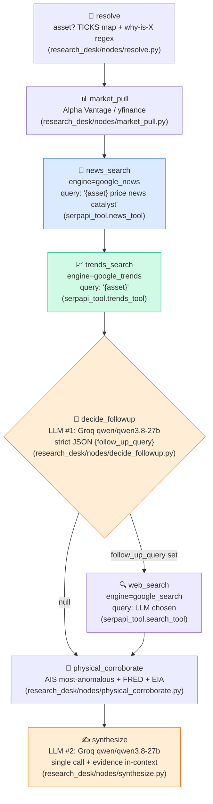
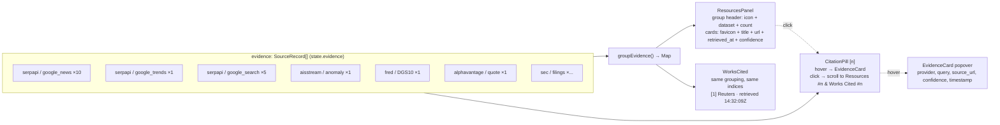

# 09 — Agent UX Peak Spec: Research Desk as Gemini Deep Research

> **Status:** DESIGN SPEC — implement against `research_desk/*` + `backend/providers/serpapi.py` + `FRONTEND_CONTRACT.md`.
> **Thesis:** Research Desk is not a chatbot. It is a **cited investigation with a visible paper trail**. The terminal's moat is the verdict — the trace panel is the proof. Every SerpApi call must be *seen* live.
> **One-line judge test:** Can a judge, in 10 seconds, point at the screen and say "that's 3 SerpApi engines, live, with queries and counts"? If not, the UI failed.

---

## 0. Why this exists — SerpApi justice (read this three times)

`final_mvp.md:85` says it plainly:

> *UI narrates each stage as it fires ("Searching news..." ...) plus a **search trace panel** showing the **literal SerpApi calls (engine, query, timestamp)** as they happen. **This one panel is your cheapest, highest-leverage "meaningful SerpApi usage" evidence for judges.***

That sentence is the entire spec. Everything below is how you make that sentence *visually undeniable*.

**Repetitive stress, because teams forget under deadline:**

1. Trace panel = cheapest, highest-leverage SerpApi evidence. Build it first.
2. Trace panel must show **literal** `engine` + `query` + `timestamp` + `result_count` — not paraphrased, not hidden in a tooltip.
3. Resources panel must **quote APIs with icons** — group by provider/dataset, show `source_url`, `retrieved_at`, `confidence`, favicon.
4. Report must cite with **clickable pill citations `[1][2]`** that hover to `SourceRecord` Evidence cards and scroll to Works Cited.
5. Every number/claim everywhere gets an **Evidence hover** (`final_mvp.md:92`).
6. Repeat: trace panel is not polish. It is the demo.

If you cut one thing, cut an animation. Do not cut the trace panel.

---

## 1. Competitive teardown — what "peak" actually looks like

We hunted Gemini Deep Research, Perplexity, OpenAI Deep Research, Linear, LangSmith, and open_deep_research scaffold behavior. This is what winners do and what we steal.

### 1.1 Gemini Deep Research (the north star)

**What Gemini does right:**
- **Three-column layout:** Left = thinking trace (collapsible), Center = synthesized report, Right = sources/resources drawer. All three visible simultaneously on desktop — never hides the trace during synthesis.
- **Thinking waterfall:** Each research step is a row with icon + step title + expandable reasoning text + inline source chips. Steps stream in real-time with a pulsing dot → checkmark transition.
- **Resources grouped by type:** "Websites (12), Images (8), News (5)" with favicon + domain + snippet. Each resource is a card you can click to open. Count badge per group.
- **Cited report:** Inline citations as superscript pills `[1][2]` after every factual sentence, colored by source type. Clicking highlights source in drawer. Hover shows quote + URL + timestamp.
- **Plan-then-execute:** Gemini shows its research plan *before* executing — we mirror this by showing the 7-stage pipeline skeleton immediately (all stages in `pending` state) then animating through them.
- **Depth signal:** Gemini shows "Searched 124 sources, read 47 pages" — we show `evidence_count` + per-engine `result_count` accumulation.

**What we steal:** Three-column layout, thinking waterfall with expandable reasoning, grouped resource cards with favicons, inline citation pills with hover.

### 1.2 Perplexity (the citation king)

- **Source cards above the answer:** Horizontal scrollable source cards (favicon + domain + title) appear *before* the answer loads — proves retrieval happened.
- **Inline citations after every claim:** `[1][2][3]` style, sequential numbering, clicking scrolls to source list. Numbered consistently — source [1] in paragraph 1 = source [1] in Works Cited.
- **Related questions:** Shows "what people are asking" as follow-up research prompts — we mirror with `google_autocomplete` "What people are asking" panel.
- **Search query disclosure:** Perplexity Pro shows "Searched: query string" — we do this per-stage in the trace.

**We steal:** Pre-answer source row, consistent citation numbering, disclosed search queries.

### 1.3 OpenAI Deep Research (o3-based)

- **Long-running with progress:** Shows "Researching... (3/12 sources checked)" with elapsed time, because deep research takes 5-15 minutes. Our pipeline is seconds, but we still show elapsed time per stage for the same "work is happening" affordance.
- **Tool-call transparency:** Shows "Searched web for X", "Read Y", "Analyzed Z" as discrete tool-call rows with status icons.
- **Report is long and structured:** Multi-section with headings, tables, inline citations — we enforce exactly this with `synthesize.py:10` 9-section template.

**We steal:** Tool-call rows with verb labels, elapsed-time affordance, structured long-form report.

### 1.4 Linear (the trace waterfall gold standard)

- **Issue trace waterfall:** Linear's command palette and activity timeline use a vertical waterfall with left-border line, status dot on the line, duration pill top-right, and expandable detail rows. Clean, monospace timestamps.
- **Keyboard-first:** Everything is keyboard-navigable (j/k to move, enter to expand, `/` to search). Our trace panel should be keyboard-navigable too.

**We steal:** Vertical left-border waterfall, monospace duration pills, keyboard navigation.

### 1.5 LangSmith / LangGraph Studio (what engineers see)

- **Node graph view:** LangSmith shows StateGraph nodes as cards with input/output state diff, latency, token count. Each node execution is expandable JSON.
- **Stream modes:** `stream_mode="updates"` (node-by-node) vs `"values"` (full state) — we use `updates` in `research_desk/stream.py:58` which maps 1:1 to our trace rows.
- **Run trace table:** Each run traces: `node_name | status | latency | tokens | inputs → outputs`.

**We steal:** Node-card with I/O diff, `updates` stream mode → trace row mapping, latency per node.

### 1.6 open_deep_research scaffold

- Already has `scope → research → write` streaming — we fork it, swap Tavily for `research_desk/tools/serpapi_tool.py:40` `TOOLS`, and point models at Groq `research_desk/config.py`.

### 1.7 Synthesis — what "peak" means for AAJ

| Pattern | Source | AAJ implementation |
|---|---|---|
| 3-column layout (trace \| report \| resources) | Gemini | Research Desk layout §2 |
| Thinking waterfall with status dots | Gemini + Linear | Trace waterfall §3 |
| Literal SerpApi call disclosure | Perplexity + OAI | Per-row engine/query/result_count |
| Grouped resource cards + favicons | Gemini | Resources panel §4 |
| Inline citation pills `[1][2]` | Perplexity | Cited report §5 |
| Hover Evidence cards everywhere | `final_mvp.md:92` | EvidenceCard §5.4 + §7 |
| Verbose stage narration | OAI + Gemini | WS `STAGE_LABELS` streaming §6 |
| Node I/O JSON expandable | LangSmith | Collapsed JSON payload §3.3 |
| Rising queries / regional / autocomplete badges | AAJ moat `final_mvp.md:96-100` | Asset header chips §4.5 |

---

## 2. Layout — the three-column Research Desk

### 2.1 Desktop (≥1280px) — the demo layout

```
┌─────────────────────────────────────────────────────────────────────────────┐
│  Header: [AAJ]  Research Desk — Why is Brent moving?     [Export] [Share]  │
├──────────────┬──────────────────────────────────┬───────────────────────────┤
│              │                                  │                           │
│  TRACE       │  REPORT                          │  RESOURCES                │
│  WATERFALL   │  (cited markdown)                │  (grouped Evidence)       │
│  340px       │  flex-1  (max 780px centered)    │  360px                    │
│  sticky      │  scroll                          │  sticky                   │
│  top-16      │                                  │  top-16                   │
│              │                                  │                           │
│  7 rows +    │  9 sections +                    │  Groups:                  │
│  SerpApi     │  citation pills +                │   SerpApi news (n)        │
│  literal     │  Works Cited +                   │   SerpApi trends          │
│  rows        │  Contradicting / Confidence       │   SerpApi search          │
│              │                                  │   Physical (AIS/FRED/EIA) │
│              │                                  │   Market (AV/yfinance)    │
│              │                                  │                           │
│  ──────────  │  ──────────────────────────────  │  ──────────────────────   │
│  Evidence    │  Rising queries │ Regional strip │  "What people are asking" │
│  count: 12   │  chips (no extra calls)          │  autocomplete panel       │
│  WS status ● │                                  │                           │
└──────────────┴──────────────────────────────────┴───────────────────────────┘
```

**Rules:**
- All three columns visible simultaneously on demo screen — never tab-hide the trace.
- Trace is `position: sticky; top: 64px; height: calc(100vh - 64px); overflow-y: auto` — always visible while report scrolls.
- Resources similarly sticky on right.
- On 1080p projector, columns collapse to: trace on top (horizontal compact), report full width, resources as bottom sheet — but for judge demo, force desktop 1280px+ (open browser maximized).
- Mobile (<768px): single column: trace accordion → report → resources bottom sheet.

### 2.2 Skeleton / loading sequence

1. On `POST /api/research/run` or WS `{"query": "..."}`, immediately render **7 skeleton rows** (all `pending` / gray dot) — this is the "plan shown before execution" pattern from Gemini.
2. As each `WS /ws/research/{session}` event arrives (`research_desk/stream.py:56-66` `graph.stream(..., stream_mode="updates")`), flip row `pending → running` (pulse) → `done`/`skipped` (checkmark / muted dash).
3. Report column shows streaming markdown placeholder ("Writing report...") until `synthesize` final event.
4. Resources column accumulates cards as evidence arrives — news cards appear after `news_search`, trends after `trends_search`, etc.

---

## 3. Trace waterfall — the star of the show

### 3.1 The 7(+1) fixed rows

One row per `STAGE_LABELS` key in `research_desk/stream.py:15-24` + conditional `web_search` branch. Always render all 8 rows in skeleton; `web_search` shows `pending → skipped (no follow-up query)` when `decide_followup` returns `null`.

| # | Stage key (`research_desk/stream.py:15`) | Label (stream `label`) | Icon | Engine badge | LLm? | Can skip? |
|---|---|---|---|---|---|---|
| 1 | `resolve` | Resolving asset... | 🎯 | — | No | Yes (unknown entity → "no known entity") |
| 2 | `market_pull` | Pulling market data... | 📊 | `AV/yfinance` | No | Yes (unresolved or provider error) |
| 3 | `news_search` | Searching news... | 📰 | `google_news` | No | Yes (timeout/SERP error) |
| 4 | `trends_search` | Checking trends... | 📈 | `google_trends` | No | Yes |
| 5 | `decide_followup` | Deciding follow-up... | 🤔 | `Groq qwen/qwen3.8-27b` | **Yes (LLM #1)** | Yes (no key or LLM error → null) |
| 6 | `web_search` | Searching web... | 🔍 | `google_search` | No | **Yes — conditional branch** (`research_desk/graph.py:23-24`) |
| 7 | `physical_corroborate` | Checking physical signals... | 🚢 | `AIS/FRED/EIA` | No | Yes (partial — AIS + FRED + EIA each best-effort) |
| 8 | `synthesize` | Writing report... | ✍️ | `Groq qwen/qwen3.8-27b` | **Yes (LLM #2)** | Yes (no key → stub `research_desk/nodes/synthesize.py:44`) |

> **Exactly 2 LLM calls ever.** Hard cap. `research_desk/config.py:12-15` enforces this. No loops.

### 3.2 Row anatomy — pixel spec

```
┌──────────────────────────────────────────────────────────────────────┐
│ ○────  📰  Searching news...                      [google_news]  1.2s │
│ │      query: "BRENT price news catalyst"  ·  10 results  ·  14:32:07│
│ │      ┌───────────────────────────────────────────────────────────┐ │
│ │      │ ▶ payload  { engine, query, result_count, timestamp }    │ │
│ │      │   { "news_results": [...], "evidence": [...] }   [Copy]  │ │
│ │      └───────────────────────────────────────────────────────────┘ │
│ ○────  📈  Checking trends...                     [google_trends] 0.8s│
│ ...                                                                  │
└──────────────────────────────────────────────────────────────────────┘
         │ status dot timeline (left border) connects all rows
```

**Per-row spec:**

| Element | Spec | Token |
|---|---|---|
| Left timeline line | `1px solid var(--border)` vertical connecting dots | `border-muted` |
| Status dot | `8px` circle, on the line. `running` = `var(--accent)` + `animate-pulse` + `box-shadow: 0 0 8px var(--accent)`; `done` = `var(--success)` solid; `skipped` = `var(--muted)` hollow ring; `error` = `var(--danger)` |  |
| Stage icon | `16px` emoji or `lucide-react` icon (`Search`, `TrendingUp`, `Ship`, `PenLine`, `Target`, `BarChart3`, `Brain`) — left of label | `text-base` 16px |
| Label | `Geist Sans 13px / 500` (Inter fallback) — `research_desk/stream.py:15-24` value verbatim | `text-sm font-medium` |
| Engine badge | `Geist Mono 10px / 500`, `uppercase`, `letter-spacing: 0.04em`, `bg: var(--muted-bg)`, `border: 1px solid var(--border)`, `rounded: 4px`, `px-1.5 py-0.5`. Values: `google_news` (blue), `google_trends` (emerald), `google_search` (violet), `google_autocomplete` (amber), `Groq` (orange), `AIS` (cyan), `FRED` (gray), `AV/yfinance` (slate) | `font-mono text-[10px]` |
| Duration pill | `Geist Mono 11px / 400`, `bg: var(--muted-bg)`, `rounded-full px-2 py-0.5`, `color: var(--muted-fg)`. Compute: `finished_at - started_at` from `research_desk/nodes/_util.py:11` `trace_entry()`. Show `—` while running, `0.8s` / `1.2s` / `342ms` when done. | `font-mono text-[11px]` — **exactly as briefed: Geist Mono 11px** |
| Query string | `Geist Mono 11px`, `color: var(--muted-fg)`, truncated `max-w: 28ch` with `title` hover for full value. Source: `trace[].query` (only present on SerpApi nodes `news_search`, `trends_search`, `web_search`). |  |
| Result count | `Geist Mono 11px`, `color: var(--success)` if `>0` else `var(--muted-fg)`. E.g. `10 results`, `1 signal`, `—` if skipped. From `trace[].result_count`. |  |
| Timestamp | `Geist Mono 11px`, `color: var(--muted-fg)`, `HH:MM:SS` local or `ISO` on hover. From `trace[].timestamp` / `started_at`. |  |
| Expand chevron | `▶` / `▼` 10px, `color: var(--muted-fg)`, toggles JSON payload |  |
| Collapsed JSON | `Collapsible` (Radix or Headless) — `Geist Mono 11px`, `bg: #0a0a0a`, `border: 1px solid var(--border)`, `rounded: 6px`, `p-3`, `max-h: 240px overflow-auto`, `white-space: pre-wrap`, with **Copy** button (`navigator.clipboard.writeText(JSON.stringify(payload, null, 2))`) top-right. Shows `trace[].*` extras + node output summary. |  |
| Reason (if skipped) | `Geist Mono 11px`, `color: var(--warning)`, italic. E.g. `skipped — no follow-up query`, `skipped — no LLM_API_KEY (groq)`, `skipped — unresolved entity`. From `trace[].reason`. |  |

**SerpApi literal disclosure — the judge test:**

Every SerpApi row **must** expose these fields as *visible text* (not just in expanded JSON):

```
[engine badge]  query: "BRENT price news catalyst"  ·  result_count: 10  ·  timestamp: 14:32:07
```

That line is the SerpApi justice. It is cheap. It is high-leverage. It is the reason the panel exists.

### 3.3 Trace data contract (WS → UI)

From `research_desk/stream.py:56-66` + `_util.py:11`:

```typescript
// WS event per node (research_desk/stream.py:64-66)
// { session, node, label, ...lastTraceEntry }
type TraceEvent = {
  session: string;
  node: string;            // "news_search" etc — the StateGraph node key (research_desk/graph.py:29-36)
  label: string;           // STAGE_LABELS[node] — "Searching news..."
  stage: string;           // same as node, from trace_entry()
  status: "running" | "done" | "skipped" | "error"; // never "pending" over WS — pending is skeleton before first event
  timestamp: string;       // ISO 8601 from _util.now() — also done's timestamp
  started_at?: string;     // ISO, from _util.now() at node entry
  finished_at?: string;    // ISO
  engine?: string;         // "google_news" | "google_trends" | "google_search" | "google_autocomplete"
  query?: string;          // literal SerpApi q param — MUST display
  result_count?: number;   // items.length — MUST display for SerpApi nodes
  result_count_display?: string; // derived: `${n} results`
  duration_ms?: number;    // derived: finished_at - started_at
  reason?: string;         // when skipped — e.g. "no follow-up query", "no LLM_API_KEY (groq)"
  asset?: string;          // resolve/market_pull
  chokepoint?: string;     // physical_corroborate — most anomalous
  follow_up_query?: string | null; // decide_followup
  // ... plus any node-specific extras spread into payload JSON
};

// Trace array in blocking POST /api/research/run (research_desk/stream.py:32-34)
// { report, trace: TraceEvent[], evidence_count }
// trace is ordered by stage execution: resolve → ... → synthesize
```

**Duration calculation (frontend):**
```ts
function durationMs(e: TraceEvent): number | null {
  if (!e.started_at || !e.finished_at) return null;
  return new Date(e.finished_at).getTime() - new Date(e.started_at).getTime();
}
function formatDuration(ms: number | null): string {
  if (ms == null) return "—";
  if (ms < 1000) return `${ms}ms`;
  return `${(ms/1000).toFixed(1)}s`;
}
```

### 3.4 Component spec — TraceWaterfall

```typescript
// components/research/TraceWaterfall.tsx
type Props = {
  trace: TraceEvent[];           // accumulated from WS or POST
  pendingStages?: string[];      // stages not yet started — show as pending skeleton
  wsStatus: "idle" | "connecting" | "streaming" | "done" | "error";
  evidenceCount: number;
  onCopyPayload?: (json: string) => void;
};

// Subcomponents:
// - TraceRow — single stage row (as specced §3.2)
// - EngineBadge — colored mono badge per engine
// - DurationPill — mono 11px pill
// - JsonPayload — collapsible pre + Copy button
// - StatusDot — 8px dot on timeline line

// Behavior:
// - Auto-scroll to latest running row when new event arrives (smooth scroll, but don't hijack if user scrolled up — show "New events" pill)
// - Keyboard: j/k navigate rows, Enter toggles expand, c copies payload of focused row
// - Copy payload: copies JSON.stringify(traceEntry, null, 2) + toast "Copied trace payload"
// - Skipped rows are muted (opacity 0.6) but NOT hidden — they explain the branch ("web_search skipped — no follow-up query" is expected, not an error)
// - Timeout guard: if a node takes > TIMEOUT_S (research_desk/config.py:22 — 15s) show "timeout guarded — skipped" immediately (backend already does trace_entry status skipped, frontend just renders it)
```

**Visual reference — state colors:**

| Status | Dot | Label color | Row opacity |
|---|---|---|---|
| pending | `○` hollow gray `border: 1.5px solid var(--muted)` | `var(--muted-fg)` | 0.5 |
| running | `●` accent pulsing + glow `bg: var(--accent) animate-pulse` | `var(--accent)` with shimmer | 1.0 |
| done | `●` solid success `bg: var(--success)` + checkmark `✓` overlay | `var(--fg)` | 1.0 |
| skipped | `○` hollow muted + dash `—` | `var(--muted-fg)` italic | 0.7 |
| error | `●` danger `bg: var(--danger)` | `var(--danger)` | 1.0 |

### 3.5 Mermaid — pipeline as the waterfall would render it



---

## 4. Resources panel — grouped Evidence with icons

### 4.1 What it is — the Evidence drawer done right

The Resources panel is the **reading counterpart** to the trace waterfall's *doing*. Trace shows "what we did", Resources shows "what we found". Every card is a `SourceRecord` from `backend/models/source_record.py:9-18` (also `research_desk/state.py:18` `evidence: list`).

Grouped like Gemini groups resources — **by provider + dataset**, not chronologically — with counts that prove breadth.

### 4.2 Group taxonomy — fixed

| Group id | Provider / dataset | Icon | Color accent | Purpose |
|---|---|---|---|---|
| `serpapi-news` | `serpapi / google_news` | 📰 | Blue `bg-blue-500/10 border-blue-500/30` | Event discovery, headlines |
| `serpapi-trends` | `serpapi / google_trends` | 📈 | Emerald `bg-emerald-500/10` | Attention spikes, rising queries |
| `serpapi-search` | `serpapi / google_search` | 🔍 | Violet `bg-violet-500/10` | Verification, deep dive |
| `serpapi-autocomplete` | `serpapi / google_autocomplete` | 💬 | Amber `bg-amber-500/10` | "What people are asking" |
| `market-av` | `alphavantage` / `yfinance` | 📊 | Slate `bg-slate-500/10` | Quotes, charts, fundamentals |
| `market-sec` | `sec` | 🏦 | Teal `bg-teal-500/10` | Filings 10-K/10-Q/8-K |
| `physical-ais` | `aisstream` | 🚢 | Cyan `bg-cyan-500/10` | Chokepoint traffic anomaly |
| `physical-fred` | `fred` | 🏛️ | Gray `bg-gray-500/10` | 10Y, CPI, macro series `DGS10` |
| `physical-eia` | `eia` | ⛽ | Orange `bg-orange-500/10` | Oil inventories `WTTSTUS1` |

> Rule: **Groups render only if they have ≥1 record.** Empty groups are omitted — no "0 results" dead weight. But the group header still appears in the trace (engine badge) so the judge sees the *attempt*.

### 4.3 Card anatomy — every SourceRecord renders as this

```
┌─────────────────────────────────────────────────────┐
│ 📰  Reuters  ·  google_news              ·  [high]  │
│ Putin says oil...                    ↗  reuters.com │
│ "...Brent rose 3% after..."                         │
│ ───────────────────────────────────────────────────  │
│ provider: serpapi  query: "BRENT price news catalyst"│
│ retrieved: 14:32:09 UTC  ·  2m ago            ⧉ Copy│
│ source_url: https://reuters.com/...  [open]         │
└─────────────────────────────────────────────────────┘
```

**Fields per card (from `SourceRecord` `backend/models/source_record.py:9-18` + `apis_aaj.md:1034-1044`):**

| Field | Display | Pixel spec |
|---|---|---|
| Provider icon + badge | `16px` icon + `Geist Mono 10px uppercase` dataset badge | Left of title |
| Publisher / domain | Extracted from `payload.source` or `source_url` hostname — e.g. `Reuters`, `reuters.com` | `Geist Sans 12px / 500` |
| Title / snippet | `payload.title` fallback `payload.snippet` fallback `payload.series_id` — truncated to `2 lines` via `line-clamp-2` | `Geist Sans 13px / 500`, `leading-tight` |
| Payload excerpt | `payload.snippet` or `payload.value` with `...` | `Geist Sans 12px / muted` |
| Confidence | `confidence: 0.0-1.0` → pill `high` (≥0.8 green) `med` (0.5 amber) `low` (<0.5 red) — hidden if `null` | `Geist Mono 10px`, `rounded-full px-1.5` |
| Favicon | `https://www.google.com/s2/favicons?domain={hostname}&sz=32` — `16px` rounded, fallback to provider icon on error | `16px img`, `rounded-sm` |
| Query | `query: "BRENT..."` — `Geist Mono 11px muted`, only for SerpApi-sourced records |  |
| Retrieved_at | `retrieved_at` ISO → relative `2m ago` + absolute `14:32:09 UTC` on hover (via `title`) | `Geist Mono 11px muted` |
| Observed_at | `observed_at` if present (e.g. news `published_at`, AIS `observed_at`) — `Geist Mono 11px muted` |  |
| Source URL | `source_url` as `↗ open` link — `target="_blank" rel="noopener"` — truncated domain + `external-link` icon | `Geist Sans 11px accent underline-offset` |
| Copy button | `⧉` — copies `source_url` or full record JSON — `Geist Mono 11px` |  |
| Hover | Card lifts `shadow-md`, `border-accent/30` | `transition 120ms` |

**SerpApi quoting with icons — this must be visually obvious:**

Each SerpApi card shows **three** SerpApi-specific affordances together:
1. Engine badge (`google_news` / `google_trends` / `google_search`) — mono 10px
2. Literal `query` string that produced it — mono 11px
3. Publisher favicon + `source_url` (for news/search) or rising-query chip (for trends)

If those three are not simultaneously visible, the SerpApi usage is not "meaningful" to a judge scanning screenshots. Quote the APIs with icons.

### 4.4 Group header spec

```
┌─────────────────────────────────────────────────────┐
│ 📰  SerpApi · google_news              10 sources   │
│ "BRENT price news catalyst"                          │
│ [::::::::::::::::::..........]  retrieved 14:32 UTC  │
└─────────────────────────────────────────────────────┘
```

| Element | Spec |
|---|---|
| Group icon | `16px` per taxonomy above |
| Group title | `Geist Sans 12px / 600` — e.g. `SerpApi · google_news` |
| Count badge | `Geist Mono 11px` — `10 sources` — `bg-muted rounded-full px-2 py-0.5` |
| Query echo | `Geist Mono 11px muted` — the SerpApi query that populated this group (from `trace[].query`) |
| Collapse toggle | Group is `Collapsible defaultOpen=true` — chevron `▼` rotates — remembers state per session in `localStorage:research-resources-collapsed` |
| Retrieved spread | `Geist Mono 10px muted` — min/max `retrieved_at` across group |

### 4.5 Moat-proving chips (reuse of `google_trends` fields — zero marginal calls)

From `backend/providers/serpapi.py:130-151` — `google_trends` retains **FULL raw response** where `rising_queries` + `geo breakdown` already live. Surface them without new calls:

- **Rising/breakout queries badge** (`final_mvp.md:98`): chip row next to Physical-vs-Narrative panel: `Hormuz blockade ↑850%` `oil price today ↑420%` — rendered from `trends_results.payload.rising_queries` — `Geist Mono 11px`, `bg-emerald-500/10 border-emerald-500/30`, `↑` + `%`.
- **Regional interest strip** (`final_mvp.md:99`): small bar strip of top 3-5 `geo` entries from same `google_trends` call — horizontal bars per country, `Geist Mono 10px` labels.
- **"What people are asking" panel** (`final_mvp.md:100`): `google_autocomplete` engine (`backend/providers/serpapi.py:180-194`) — raw suggestion list like `why is oil so expensive`, `will brent hit 100` — rendered as `Geist Sans 13px` clickable pills that re-run Research Desk with that query.

These are free visual moat. Do not hide them in a collapsed section.

### 4.6 Component spec — ResourcesPanel

```typescript
// components/research/ResourcesPanel.tsx
type Props = {
  evidence: SourceRecord[];          // from POST / final WS message + accumulated traced evidence
  trace: TraceEvent[];              // to echo query per group
  onCitationHover?: (idx: number) => void;
  onCitationClick?: (idx: number) => void;
  selectedCitation?: number | null; // linked from report hover/click
};

// Subcomponents:
// - ResourceGroup — collapsible per provider/dataset (§4.2), defaultOpen, count badge
// - SourceCard — per SourceRecord (§4.3) — includes favicon, confidence pill, retrieved_at, copy
// - RisingChips — rising_queries from google_trends payload
// - GeoStrip — geo breakdown bar strip
// - AutocompletePanel — google_autocomplete suggestions (if present)
// - FaviconImg — 

// Grouping logic:
// function groupEvidence(evidence: SourceRecord[]): Map<string, SourceRecord[]> {
//   // key = `${provider}/${dataset}` — e.g. "serpapi/google_news"
//   // serpapi groups further split by engine via dataset field
// }

// Citation linking:
// - SourceCard for index i has id=`evidence-${i}` and data-evidence-idx
// - When report citation [i] is hovered/clicked, this panel scrolls to #evidence-i and highlights (ring-accent)
// - Conversely, clicking a SourceCard highlights its citations in the report (bidirectional)

// Empty state:
// - If evidence.length === 0: show "No evidence yet — run a search" + skeleton + tip: try "BRENT", "AAPL", "why is Brent moving?"
// - Never render empty groups
```

---

## 5. Cited report rendering — the polished output

### 5.1 Report contract

From `research_desk/nodes/synthesize.py:5-25` + `agentic_implementation_plan.md:84-96`:

**9 enforced sections** (in order):

| # | Section | Purpose |
|---|---|---|
| 1 | Executive thesis | One-paragraph synthesis — the verdict |
| 2 | What happened | Factual timeline / move size |
| 3 | Primary drivers | Ranked catalysts |
| 4 | Supporting evidence | Claims with citations |
| 5 | Contradicting evidence | Even if thin — **always present** (prompt forces it) |
| 6 | Affected assets | Propagation / exposure list |
| 7 | What to watch next | Forward catalysts |
| 8 | Confidence | `High / Medium / Low` + why — low when data thin (`synthesize.py:19`) |
| 9 | Sources + timestamps | Works Cited — every `source_url` + `retrieved_at` |

LLM prompt enforces: *every factual claim must cite collected evidence by index `[E0], [E1]...`* (`synthesize.py:17-18`). The report markdown thus contains literal `[E0]` tokens that frontend rewrites into pill components.

**Stub fallback** (`synthesize.py:40-60`): when no `LLM_API_KEY`, `synthesize` status is `skipped` and stub template is returned — still 9 sections but marked `Stubbed run collected N evidence records` + `Confidence: Low (stubbed synthesis)`. UI must badge this as `stub report — set LLM_API_KEY for full synthesis` (amber banner top of report).

### 5.2 Citation pill spec — the `[1][2]` pills

LLM emits `[E0]`, `[E1]` etc; fallback stub uses `[E0]`; we normalize both to sequential `[1][2]` in UI.

```
Brent rose 5.4% after Hormuz traffic fell 31%[1][2] while attention spiked 88%[3].
                                                      ^^^ ^^^                 ^^^
                                                      pills linking to Works Cited
```

| Property | Spec |
|---|---|
| Shape | `rounded-md`, `px-1 py-0`, `border: 1px solid var(--border)`, `bg: var(--muted-bg)` |
| Typography | `Geist Mono 11px / 500`, `color: var(--accent)` |
| Hover | `bg-accent/10 border-accent/40` + show Evidence hover card (§5.4) |
| Active (linked from Resources) | `bg-accent/20 border-accent ring-1 ring-accent/30` |
| Click | `scrollIntoView({behavior:"smooth", block:"center"})` to `#evidence-{idx}` in Resources panel + `/#cite-{idx}` in Works Cited + highlight ring 1.2s |
| Failed / low-confidence citation | If `evidence[idx].confidence < 0.5` the pill gets `border-warning/40 bg-warning/10` + `⚠` suffix |
| Missing index | If `[E99]` absent from `evidence` array, render as `Geist Mono 11px muted + strikethrough` with `title="Evidence not collected"` — never crash |

**Implementation transform:**

```ts
// utils/citations.ts
// LLM markdown contains [E0] [E1] ... — rewrite to clickable pills
// Also handle [1] [2] variants via regex
const CITE_RE = /\[E?(\d+)\]/g;
function renderWithCitations(markdown: string, evidence: SourceRecord[]) {
  // Replace matches with placeholder tokens, split, then interpolate
  // Each token → <CitationPill idx={n} record={evidence[n]} onHover onClick />
}
```

### 5.3 Works Cited section — grouped by provider

Bottom of report, after Confidence. Looks like Gemini's "Sources" footer but grouped.

```markdown
## Sources + timestamps

### 📰 SerpApi · google_news — 10
[1] Reuters — "Brent jumps 5% on Hormuz fears" · reuters.com · retrieved 2026-09-24T14:32:09Z · ↗ reuters.com/article/...
[2] Bloomberg — "Oil extends gains..." · bloomberg.com · retrieved 14:32:09Z · ↗ ...

### 📈 SerpApi · google_trends — 1
[11] google_trends BRENT · rising: Hormuz blockade ↑850% · retrieved 14:32:10Z

### 🔍 SerpApi · google_search — 5
[12] EIA — "Weekly petroleum status" · eia.gov · ↗ ...

### 🚢 Physical · AIS — most-anomalous: hormuz
[17] AIS anomaly hormuz · traffic 94 vs 137 baseline (-31%) · retrieved 14:32:12Z

### 🏛️ Physical · FRED — DGS10
[18] FRED DGS10 · 4.21% · retrieved ...

### 📊 Market · AV/yfinance — BRENT
[19] Alpha Vantage quote BRENT · 89.42 USD · retrieved ...
```

**Per-entry spec same as SourceCard §4.3 but in compact list form** (`Geist Mono 11px` for url/timestamp, `Geist Sans 13px` for title).

**Grouping logic shared with Resources panel** — same function, so numbering is consistent. Evidence indices are **global** (the `[1]` in report paragraph 2 = `[1]` in Works Cited = `[1]` card in Resources drawer) — single `evidence: SourceRecord[]` array indexes all three.

### 5.4 Evidence hover card — everywhere (final_mvp.md:92)

> *Any number/claim on any screen expands to source + timestamp on hover. Small UI component, reused everywhere.*

Primitive used in **three** places: inline citation pill hover (§5.2), SourceCard hover (§4.3), and generic `EvidenceHover` wrapping any claimed number on Asset/Market/Map screens.

```typescript
// components/evidence/EvidenceHover.tsx
// Radix HoverCard or Popover — opens on hover (200ms delay), also tap on mobile
type Props = {
  children: React.ReactNode; // the pill / number / claim
  record: SourceRecord;
  index: number;             // [n]
};

// Card content (220px min-w, 360px max-w):
┌─────────────────────────────────────────┐
│ [1] 📰 Reuters                          │
│ "Brent jumps 5% on Hormuz fears"        │
│ reuters.com · google_news               │
│ ─────────────────────────────────────── │
│ query: "BRENT price news catalyst"      │
│ retrieved: 2026-09-24T14:32:09Z  2m ago  │
│ observed:  2026-09-24T14:28:00Z          │
│ confidence: high (0.92)                 │
│ ─────────────────────────────────────── │
│ ↗ Open source  ·  ⧉ Copy link  ·  [1]   │
└─────────────────────────────────────────┘

// Styling: bg-popover, border, shadow-lg, rounded-lg, p-3, Geist Sans 12px body + Geist Mono 11px meta
// Positioning: side="top" align="center" with collision detection (flip to bottom if needed)
// Mobile: tap opens BottomSheet drawer instead of hover
```

**Critical:** Evidence hover everywhere means the **same** `EvidenceHover` component wraps:
- Citation pills in report
- Numbers in Asset screen (`Physical-vs-Narrative` verdict deltas)
- Counts in World Map chokepoint panels
- Prices in Market Home (future)

### 5.5 Low-confidence + contradicting section — when thin

From `synthesize.py:17-19`:

> *include a 'Contradicting evidence' section even if thin; end with 'Sources + timestamps' ... If evidence is sparse, say so and lower Confidence.*

**UI handling:**
- If `evidence.length < 3` or `report` contains `Confidence: Low`, render amber callout top of report:

```
┌──────────────────────────────────────────────────────────────────┐
│ ⚠ Low confidence — thin evidence (2 sources). Contradicting     │
│   data is limited. Treat thesis as provisional; watch next:      │
│   re-run with more specific query.                               │
└──────────────────────────────────────────────────────────────────┘
```
`bg-amber-500/10 border-amber-500/30 text-amber-700 dark:text-amber-300`, `Geist Sans 13px`, `rounded-lg p-3`.

- "Contradicting evidence" section gets no collapsed styling — expand it like every other section, even if content is "None assessed" / "No contradicting signals found". Empty ≠ hidden.

### 5.6 Report container & markdown rendering

```typescript
// components/research/CitedReport.tsx
type Props = {
  markdown: string;              // from research_desk/nodes/synthesize.py — report
  evidence: SourceRecord[];
  trace: TraceEvent[];
  status: "streaming" | "done" | "stub";
  evidenceSelected?: number | null; // highlighted from Resources click
};

// Rendering:
// - Use react-markdown + remark-gfm + rehype-highlight
// - Pre-process markdown: replace [E\d+] with <CitationPill /> tokens before passing to react-markdown
// - Custom components map:
//   h1 → Geist Sans 22px/700, border-b, pb-2, mt-8 (skip for first title)
//   h2 → Geist Sans 16px/600, mt-6, mb-3 — these are the 9 section headers — render with icon prefix (📝 thesis, 📅 happened, 🎯 drivers, ✅ supporting, ⚠️ contradicting, 🧩 affected, 👁 watch, 🎚 confidence, 📚 sources)
//   p  → Geist Sans 14px/400 leading-relaxed, text-fg
//   li → Geist Sans 14px + marker accent
//   code → Geist Mono 12px bg-muted rounded px-1
//   pre → Geist Mono 12px bg-[#0a0a0a] border rounded-lg p-3 overflow-auto
//   a  → accent underline-offset-4 hover:opacity-80 (but citations are pills, not bare links)
//   blockquote → border-l-2 border-accent bg-accent/5 pl-4 italic
//   table → same as Market Home tables (border-collapse, mono numbers)

// Container: max-w-[780px] mx-auto px-6 py-8, bg-card, typography prose prose-neutral dark:prose-invert
// Skeleton while streaming: pulse blocks + "Writing report..." + shimmer on last trace row
```

---

## 6. Interaction — WS streaming narrative + POST fallback

### 6.1 WS lifecycle (canonical)

From `research_desk/stream.py:37-90` + `FRONTEND_CONTRACT.md:34`:

```
Client                              Server (research_desk/stream.py)
  │                                      │
  │── WS connect /ws/research/{id} ─────▶│ await ws.accept()
  │── send {"query": "why is Brent..."} ─▶ raw = await ws.receive_text()
  │                                      │ json.loads(raw).get("query", raw)
  │                                      │ loop = asyncio.get_running_loop()
  │                                      │ events: Queue — _pump() thread
  │                                      │ for chunk in graph.stream(
  │                                      │   fresh_state(query), stream_mode="updates"):
  │◀── {"session":id,"node":"resolve",     │   for node, update in chunk.items():
  │      "label":"Resolving asset...",     │     last = trace[-1]
  │      "stage":"resolve","status":"done",│     loop.call_soon_threadsafe(put, {label, ...last})
  │      "asset":"BRENT",                  │
  │      "timestamp":"2026-..."} ──────────│
  │◀── {"node":"market_pull",              │
  │      "label":"Pulling market data...", │
  │      "stage":"market_pull",            │
  │      "status":"done",                  │
  │      "timestamp":"..."} ───────────────│
  │◀── {"node":"news_search",              │
  │      "label":"Searching news...",      │
  │      "engine":"google_news",           │
  │      "query":"BRENT price news...",    │
  │      "result_count":10,                │
  │      "timestamp":"..."} ───────────────│  ← SerpApi literal panel lights up here
  │◀── {"node":"trends_search",            │
  │      "engine":"google_trends",         │
  │      "query":"BRENT","result_count":1} │
  │◀── {"node":"decide_followup",           │
  │      "follow_up_query":"..."}          │
  │◀── {"node":"web_search" or              │  ← either web_search OR physical_corroborate
  │      "node":"physical_corroborate"}    │     (_needs_search branch graph.py:23)
  │◀── {"node":"synthesize",                │
  │      "label":"Writing report..."}      │
  │◀── {"session":id,"final":true,         │  await ws.send_text({final:true, report, evidence_count})
  │      "report": "# ...",                │  await ws.close()
  │      "evidence_count":12}              │
```

**Frontend hook:**

```typescript
// hooks/useResearchStream.ts
type ResearchStreamState = {
  status: "idle" | "connecting" | "streaming" | "done" | "error";
  trace: TraceEvent[];
  evidence: SourceRecord[]; // accumulated from evidence in each trace update (or fetched via POST after final)
  report: string | null;
  error: string | null;
  elapsedMs: number;
};

function useResearchStream(sessionId: string, query: string) {
  // 1) ws = new WebSocket(`${WS_BASE}/ws/research/${sessionId}`)
  // 2) onopen → ws.send(JSON.stringify({query}))
  // 3) onmessage → JSON.parse(e.data):
  //    if data.final → setReport(data.report); setStatus("done")
  //    else if data.error → setError(data.error)
  //    else → append TraceEvent (with label = STAGE_LABELS[node]), bump elapsed
  // 4) onerror/onclose (unexpected) → fallback to POST /api/research/run
  // 5) cleanup: ws.close() on unmount
}

// Session id: crypto.randomUUID() or nanoid — created on "WHY IS THIS MOVING?" click
// WS_BASE = import.meta.env.VITE_WS_BASE or `wss://${location.host}`
```

### 6.2 POST fallback (blocking)

`POST /api/research/run` (`research_desk/stream.py:27-34`):

```ts
// POST /api/research/run {query: string} → {report: string, trace: TraceEvent[], evidence_count: number}
// Used when WS unavailable or as "Retry" / "Export trace" path
// Frontend calls POST if WS fails to connect within 2s or disconnects before final:true

async function runResearchBlocking(query: string) {
  const res = await fetch("/api/research/run", {
    method: "POST",
    headers: {"Content-Type": "application/json"},
    body: JSON.stringify({query}),
  });
  return res.json() as Promise<{report: string; trace: TraceEvent[]; evidence_count: number}>;
}
```

**Demo guard:** On the projector, **warm the cache** first. Hit POST once backstage, then re-run via WS live — second run serves from `backend/cache` (SerpApi 600s/3600s TTLs per `backend/providers/serpapi.py:23-28`) so demo never hits SerpApi quota live. `SerpApiKeyPool` rotation (`serpapi.py:31-71`) is headroom, not demo path.

### 6.3 Narration strings — verbatim from stream.py

The WS `label` values are **user-visible narration** (`research_desk/stream.py:15-24`). Render them verbatim — do not paraphrase:

| Node | Narration label (exact) |
|---|---|
| resolve | `Resolving asset...` |
| market_pull | `Pulling market data...` |
| news_search | `Searching news...` |
| trends_search | `Checking trends...` |
| decide_followup | `Deciding follow-up...` |
| web_search | `Searching web...` |
| physical_corroborate | `Checking physical signals...` |
| synthesize | `Writing report...` |

Optional refinement: when SerpApi engine details arrive, **append** the query to narration in the trace row subtitle (do not replace label) — e.g. `Searching news...` + subline `BRENT price news catalyst (google_news)`.

### 6.4 Timeout-guarded skipped (non-negotiable)

Every node is `try/except` → `trace_entry(..., status="skipped", reason=...)` (`research_desk/nodes/news_search.py:24`, `trends_search.py:19`, `market_pull.py:22`, `physical_corroborate.py:22`, `web_search.py:26`, `synthesize.py:71,88`). Frontend **must** render `skipped` rows as muted but visible with `reason` italic mono — they are expected branches (especially `web_search skipped — no follow-up query` and `decide_followup skipped — no LLM_API_KEY`), not errors to hide.

```
web_search · skipped — no follow-up query · — · 14:32:11Z
decide_followup · skipped — no LLM_API_KEY (groq) · — 
synthesize · ✍️ Writing report... · skipped — no LLM_API_KEY (groq, stub report) · 342ms
```

**The 2-LLM-calls-only invariant:** Only `decide_followup` and `synthesize` instantiate `llm_client()` (`research_desk/config.py:40-57`). All other nodes are pure function calls. No hidden LLM retries. `max_retries: 2` + `parse retry ≤2` in `decide_followup.py:39-52` is still bounded.

### 6.5 Evidence hover everywhere — global primitive

`final_mvp.md:92` + `aajmvp.md:452-457`:

> Any important number/event/AI claim should be expandable to source + URL + source type + retrieval timestamp + underlying observation + related corroborating source(s).

The `EvidenceHover` card from §5.4 is the reuse-everywhere primitive. Wrap it around:
- Citation pills in report (mandatory)
- SourceCards (self-referential but shows same card on inner pill)
- Verdict deltas on Asset screen (`+5.4%`, `+18% physical`, `anomalous: hormuz -31%`)
- Chokepoint counts on Map (`94 vs 137 baseline`)
- Price cells anywhere (`FRONTEND_CONTRACT.md` `evidence[]` envelope)

Same component, same `SourceRecord` shape (`backend/models/source_record.py:9`), same `hoverCard` — judges see consistency.

---

## 7. Evidence model — SourceRecord is the single envelope

### 7.1 Shape (canonical)

`backend/models/source_record.py:9-18` / `apis_aaj.md:1034`:

```typescript
// backend/models/source_record.py:9 is the source of truth — mirror exactly
type SourceRecord = {
  provider: string;      // "serpapi" | "alphavantage" | "yfinance" | "sec" | "fred" | "eia" | "aisstream" | ...
  dataset: string;       // "google_news" | "google_trends" | "google_search" | "quote" | "position_report" | "DGS10" | ...
  entity_id: string | null;
  observed_at: string | null;  // when the event/observation actually happened (e.g. news published_at, AIS ping time)
  retrieved_at: string;        // NOW — when we fetched it (server local UTC)
  source_url: string | null;   // clickable link — news → link, SEC filing → Archives URL, FRED → fred.stlouisfed.org
  query: string | null;        // SerpApi q that produced this record — enables "quoted query" UI
  payload: Record<string, unknown>; // provider-raw (news title/snippet/link, trends timeseries, AIS lat/lon, FRED value, quote price)
  confidence: number | null;   // 0.0-1.0 where meaningful — drives pill color in §5.2 / §4.3
};
```

### 7.2 Where evidence accumulates

`research_desk/state.py:18` `evidence: list` is appended to at each stage:

| Stage node | What it appends (`evidence: [...prev, ...new]`) |
|---|---|
| `resolve` | Nothing — just `asset` + `resolved_entity` |
| `market_pull` | `quote` + `fundamentals` records from `backend/services/asset_service.get_asset()` |
| `news_search` | `serpapi.google_news()` returns `SourceRecord[]` (up to `SEARCH_BUDGET["news"]=10`) — spread directly |
| `trends_search` | `serpapi.google_trends()` returns one `SourceRecord` with **full raw** payload (rising + geo included) |
| `web_search` | `serpapi.google_search()` → `SourceRecord[]` (up to `SEARCH_BUDGET["web_search"]=5`) — only if branch taken |
| `physical_corroborate` | AIS anomaly + FRED `DGS10` + (if energy) EIA `WTTSTUS1` — each as `SourceRecord`/dict |
| `synthesize` | Does not append — just reads `evidence` into LLM context (`synthesize.py:29-37` `_evidence_text`) |

Total budget: `10 + 1 + 5 + 3 (physical) + 2 (market) ≈ 21` records max per run — cheap, bounded (`research_desk/config.py:22` `SEARCH_BUDGET`).

### 7.3 Confidence mapping (optional but powerful for pills)

| Signal | Confidence |
|---|---|
| SerpApi `google_news` item (has `link`, `snippet`, `published_at`) | `0.8` if publisher known, `0.6` otherwise |
| SerpApi `google_search` organic result | `0.7` (`link` + `snippet` present) |
| `google_trends` (attention signal) | `0.5` — correlative not causal |
| `Alpha Vantage` quote (live or cached) | `0.95` |
| `yfinance` fallback quote | `0.75` |
| AIS anomaly (most-anomalous) | `0.65` physical corroboration |
| FRED / EIA structured | `0.9` |
| `MOCK_MODE` / `stale:true` / seed fallback | Cap at `0.4` and show `stale` badge |

Surface as pill `high`/`med`/`low` per §4.3 — drives citation pill warning state.

---

## 8. Component inventory — file map

### 8.1 New research components (create these)

```
frontend/src/
  components/research/
    TraceWaterfall.tsx          # §3.4 — sticky waterfall, 7 rows, status dots, mono pills
    TraceRow.tsx                # single row — icon + label + badge + duration + expand JSON
    EngineBadge.tsx             # mono 10px badge per engine (google_news etc)
    DurationPill.tsx            # Geist Mono 11px pill — finished_at - started_at
    JsonPayload.tsx             # collapsible <pre> + Copy button
    ResourcesPanel.tsx          # §4.6 — grouped SourceCards, sticky right drawer
    ResourceGroup.tsx           # collapsible per provider/dataset group
    SourceCard.tsx              # §4.3 — single SourceRecord card
    FaviconImg.tsx              # favicon with provider-icon fallback
    CitedReport.tsx             # §5.6 — react-markdown + citation pill interpolation
    CitationPill.tsx            # §5.2 — [1] mono pill + hover card + scroll-to
    WorksCited.tsx              # §5.3 — grouped list bottom of report
    LowConfidenceBanner.tsx     # §5.5 — amber callout when thin
    RisingChips.tsx             # §4.5 — rising_queries badge row
    GeoStrip.tsx               # §4.5 — regional interest bar strip
    AutocompletePanel.tsx       # §4.5 — google_autocomplete suggestions
  components/evidence/
    EvidenceHover.tsx           # §5.4 — Radix HoverCard wrapping any claim
    EvidenceCard.tsx            # the popover content (SourceRecord detail)
  hooks/
    useResearchStream.ts        # §6.1 — WS connect/send/onmessage + POST fallback
    useElapsed.ts               # elapsed ms timer while streaming
  utils/
    citations.ts                # CITE_RE + renderWithCitations
    favicon.ts                  # faviconUrl(domain) — google s2 service
    duration.ts                 # durationMs, formatDuration, relativeTime
    evidenceGroup.ts            # groupEvidence() Map<key, Record[]>
```

### 8.2 Design system / tokens

```
tokens/
  --accent: #6366f1 (indigo) for running
  --success: #10b981 (emerald) for done
  --warning: #f59e0b (amber) for low confidence / skipped reason
  --danger: #ef4444 (red) for error
  --muted-bg: #f4f4f5 / #18181b (light/dark)
  --muted-fg: #71717a
  --border: #e4e4e7 / #27272a
  --popover: #ffffff / #09090b
  --card: #ffffff / #18181b

Typography: Geist Sans (primary), Geist Mono (meta/engine/duration/timestamp/query)
  - Mono 10px uppercase for engine badges — letter-spacing 0.04em
  - Mono 11px for duration, query, result_count, timestamp, copy — per brief
  - Sans 12-14px for titles, body, report paragraphs
```

### 8.3 Existing backend refs — do not duplicate, just wire

Every file below already exists — the UI just reads its contract:

| File | What UI reads |
|---|---|
| `research_desk/stream.py:15-24` | `STAGE_LABELS` — narration strings — render verbatim |
| `research_desk/stream.py:37-90` | `WS /ws/research/{session}` — WS lifecycle, `stream_mode="updates"`, single graph run no double invoke |
| `research_desk/stream.py:27-34` | `POST /api/research/run` — blocking fallback |
| `research_desk/graph.py:23-46` | Fixed 7-stage DAG + `_needs_search` conditional — `web_search` is the only branch |
| `research_desk/state.py:7-36` | `ResearchState` — `evidence[]`, `trace[]`, `report` |
| `research_desk/nodes/_util.py:11` | `trace_entry()` — `stage, status, timestamp, started_at, finished_at, **extra` — includes engine/query/result_count on SerpApi nodes |
| `research_desk/config.py:12-23` | `MODEL_CONFIG` (2 LLMs only), `SEARCH_BUDGET` (10/1/5), `TIMEOUT_S=15`, `MAX_RETRIES=2` |
| `research_desk/nodes/news_search.py:8-26` | SerpApi `google_news` trace includes `engine, query, result_count` |
| `research_desk/nodes/trends_search.py:5-21` | SerpApi `google_trends` trace + full raw retention |
| `research_desk/nodes/web_search.py:5-28` | SerpApi `google_search` — only if `follow_up_query` set |
| `research_desk/nodes/decide_followup.py:20-56` | LLM #1 — strict JSON `{follow_up_query}` — parse retry ≤2 — stub to null without key |
| `research_desk/nodes/synthesize.py:5-89` | LLM #2 — 9-section prompt, `[E{i}]` citation enforcement, stub report when no key |
| `research_desk/nodes/physical_corroborate.py:5-40` | AIS `most_anomalous()` + FRED `DGS10` + EIA `WTTSTUS1` (BRENT/WTI/NATGAS only) |
| `research_desk/tools/serpapi_tool.py:9-40` | Clean wrapper — `_clean()` strips `$\"'`, caps `300ch` — `TOOLS = [news, trends, search]` only |
| `backend/providers/serpapi.py:23-199` | `_TTLS`, `SerpApiKeyPool`, wire engine `google` for search (not `google_search`), `make_record` envelope, `search_trace` helper |
| `backend/models/source_record.py:9-44` | `SourceRecord` canonical shape — the single envelope for all evidence |
| `final_mvp.md:85,92,96-100` | Trace panel is cheapest leverage; evidence hover everywhere; rising/geo/autocomplete moat chips |
| `FRONTEND_CONTRACT.md:32-36` | `POST` + `WS` contracts — WS field list `session,node,label,stage,status,query?,engine?,result_count?,timestamp` + `{final:true, report, evidence_count}` |
| `agentic_implementation_plan.md:43-108` | Fixed pipeline + guardrails + streaming forwarding spec |
| `apis_aaj.md:29,1034-1089` | `SourceRecord` envelopes per data layer |

---

## 9. Pixel specs — the measurable details

### 9.1 Spacing & sizing

| Token | Value | Where |
|---|---|---|
| Trace panel width | `340px` (`w-[340px] shrink-0`) | Left sticky column |
| Resources panel width | `360px` (`w-[360px] shrink-0`) | Right sticky column |
| Report max-width | `780px` (`max-w-[780px] mx-auto`) | Center reading column |
| Trace row gap | `0` but `py-3 px-3` per row, `border-b: 1px solid var(--border)` last row none | Trace waterfall |
| Timeline line | `1px solid var(--border)` — runs full height inside `340px` panel, `left-4` from panel left | Left border of trace |
| Status dot | `8px` circle — absolutely positioned on timeline line — `left-4 -translate-x-1/2` | Dot on line |
| Engine badge | `Geist Mono 10px`, `px-1.5 py-0.5`, `rounded: 4px` | Inline with label |
| Duration pill | `Geist Mono 11px`, `px-2 py-0.5`, `rounded-full` | Top-right of row |
| Icon size | `16px` (`w-4 h-4`) | Left of label |
| Chevron | `10px` | Row expand |
| Card padding | `p-3` | SourceCard |
| Hover card max-width | `360px`, `min-width: 220px` | EvidenceCard popover |
| Report padding | `px-6 py-8` inside `max-w-780` | Report column |
| Pill padding | `px-1 py-0` | Citation pill |

### 9.2 Typography stack

```css
/* Load in index.html or layout.tsx */
@import url('https://fonts.googleapis.com/css2?family=Geist+Sans:wght@400;500;600;700&family=Geist+Mono:wght@400;500&display=swap');
/* Fallbacks: Inter, JetBrains Mono, system-ui, monospace */

/* Usage map — every mono usage is accounted for: */
.font-sans { font-family: 'Geist Sans', Inter, system-ui, sans-serif; }
.font-mono { font-family: 'Geist Mono', 'JetBrains Mono', monospace; }

/* Exact sizes per brief: */
.engine-badge { @apply font-mono text-[10px] font-medium uppercase tracking-wider; }
.duration-pill { @apply font-mono text-[11px] font-normal; } /* THE 11px pill from brief */
.query-string { @apply font-mono text-[11px]; }
.result-count { @apply font-mono text-[11px]; }
.timestamp { @apply font-mono text-[11px]; }
.citation-pill { @apply font-mono text-[11px] font-medium; }
.source-meta { @apply font-mono text-[11px]; }
.json-payload { @apply font-mono text-[11px]; }
.report-body { @apply font-sans text-[14px] leading-relaxed; }
.card-title { @apply font-sans text-[13px] font-medium leading-tight; }
```

### 9.3 Animation

| Event | Animation | Spec |
|---|---|---|
| Row enters `running` | Pulse dot | `animate-pulse duration-1200ms` + `box-shadow: 0 0 8px var(--accent)` |
| Row transitions `running → done` | Dot snap + checkmark pop | `scale-110 → scale-100` in `200ms ease-out` + checkmark `fade-in 120ms` |
| Evidence count bump | Count badge pulse | `scale-105 180ms` on each new record |
| Report section appears | Fade-up | `opacity 0 → 1, translateY 4px → 0, 220ms` staggered per section |
| Hover card open | Fade + slide | `Radix HoverCard: fade-in 120ms + slide 80ms` |
| Collapsible JSON open | Accordion height | `height 0 → auto, 180ms ease-out` |

### 9.4 Accessibility

- All interactive rows are `role="button"` with `tabIndex=0`, `Enter/Space` toggles expand.
- Citation pills are `<a href="#evidence-{n}">` anchors — screen readers announce "citation {n}, {publisher}".
- `aria-label` on status dots: `Resolving asset: running, 1.2s`.
- `Geist Mono` meets WCAG AA at 11px when `contrast-fg >= 4.5:1` against card bg — verify token contrast.

---

## 10. Sequence & dataflow — mermaid

### 10.1 WS streaming sequence (what judges literally see happen)

```mermaid
sequenceDiagram
    participant U as User (WHY button)
    participant F as Frontend hook
    participant W as WS /ws/research/{id}
    participant G as LangGraph graph.stream(updates)
    participant S as SourceRecord evidence[]
    participant L as Groq LLMs (2 calls)

    U->>F: Click WHY IS THIS MOVING? (BRENT)
    F->>W: WebSocket connect + send {"query":"why is Brent moving?"}
    W->>G: graph.stream(fresh_state(query), stream_mode="updates")
    Note over F,W: Skeleton renders: 7 rows pending

    G->>W: resolve: {stage:resolve, status:done, asset:BRENT}
    W->>F: {label:"Resolving asset...", status:done, asset:BRENT}
    F->>F: Row 1 → dot green ✓, duration pill

    G->>W: market_pull: {status:done}
    W->>F: {label:"Pulling market data..."}
    F->>F: Row 2 done; market evidence appended

    G->>W: news_search: {engine:google_news, query:"BRENT price news catalyst", result_count:10}
    W->>F: {label:"Searching news...", engine, query, result_count}
    F->>F: Row 3 done; Resources: 📰 10 cards appear
    Note over F: SerpApi justice: engine + query + count visible

    G->>W: trends_search: {engine:google_trends, query:BRENT, result_count:1}
    W->>F: {label:"Checking trends...", engine, query, result_count}
    F->>F: Row 4 done; Resources: 📈 1 card + rising chips + geo strip

    G->>L: decide_followup LLM #1 (Groq qwen3)
    L-->>G: {"follow_up_query":"Brent Hormuz supply disruption impact"}
    G->>W: decide_followup: {status:done, follow_up_query:"..."}
    W->>F: {label:"Deciding follow-up...", follow_up_query}
    F->>F: Row 5 done; branch chosen

    G->>W: web_search: {engine:google_search, query:"Brent Hormuz supply...", result_count:5}
    W->>F: {label:"Searching web...", engine, query, result_count}
    F->>F: Row 6 done (or skipped if null); Resources: 🔍 5 cards

    G->>W: physical_corroborate: {chokepoint:hormuz, anomaly:{count:94, baseline:137, pct:-31}}
    W->>F: {label:"Checking physical signals...", chokepoint:hormuz}
    F->>F: Row 7 done; Resources: 🚢 AIS + 🏛️ FRED

    G->>L: synthesize LLM #2 (Groq qwen3, max_tokens 800)
    L-->>G: "# Research Report\n## Executive thesis...\nBrent rose...[E0][E1]"
    G->>W: synthesize: {status:done, report:"# Research Report..."}
    W->>F: {label:"Writing report...", status:done}
    F->>F: Row 8 done; Report renders with citation pills

    W->>F: {final:true, report:"...", evidence_count:21}
    F->>F: Full cited report + Works Cited + confidence banner

    Note over F: All three columns now full<br/>Trace shows 8 rows done/skipped with literal SerpApi calls<br/>Resources shows 21 cards grouped<br/>Report shows 9 sections with [1][2] pills
```

### 10.2 Evidence grouping flow



---

## 11. Edge / empty / error states — never blank

| State | Render |
|---|---|
| WS not yet opened | Skeleton 7 rows pending; report placeholder "Run Research Desk to investigate..."; resources empty state with tip `"Try: BRENT, why is oil moving?, AAPL"` |
| `resolve skipped — no known entity` | Row 1 muted skipped; `market_pull skipped — unresolved entity`; report stub `not enough data` + tip; downstream still runs but `news_search` uses raw query string as asset fallback |
| `market_pull skipped` | Row 2 muted with `reason`; mark evidence count correctly — no quote cards in Resources market group (group omitted) |
| `news_search skipped` (SerpApi error/429) | Row 3 skipped + `reason: All SerpApi keys exhausted`; show empty 📰 group omitted; report synthesis lowered confidence; `TRACE` still shows engine/query/reason so judge sees the *attempt* |
| `trends_search skipped` | Same as news — omit 📈 group, keep rising chips hidden, no crash |
| `decide_followup skipped — no LLM key` | Row 5 skipped; `web_search` → skipped `no follow-up query`; graph still reaches `physical_corroborate → synthesize stub` — valid flow |
| `web_search skipped — no follow-up query` | **Expected, not error** — muted row with `—` duration; do not show warning color; this is the conditional branch from `research_desk/graph.py:23` |
| `physical_corroborate skipped` | AIS/FRED/EIA each individually best-effort (`physical_corroborate.py:21-36`) — show whichever succeeded, toast which skipped |
| `synthesize skipped — stub` | Report stub badge banner `Stub report — set LLM_API_KEY for full synthesis` + template `_stub_report()` |
| `synthesize error` (Groq 429 / OTPM 1000) | Trace row shows `skipped` with `reason`; frontend shows "Synthesis throttled (OTPM 1000) — retry in 30s" + displays `_stub_report` fallback from `synthesize.py:88`; capped `max_tokens=800` (`config.py:50-57`) prevents most OTPM trips |
| WS disconnect before `final:true` | Toast `Connection lost — retrying via POST...` then auto-fallback to `POST /api/research/run` — same query, same contract |
| `evidence.length === 0` | Low-confidence amber banner + contradicting section reads "No contradicting data — evidence too thin to assess" + Works Cited shows "(no sources collected)" |
| `MOCK_MODE=true` / `stale:true` | Badge `Demo mode (replay)` or `Stale data` on affected cards + confidence cap `low` |
| Cache-warm vs live | No UI difference — SerpApi literals same either way; if `_mock` replay (`serpapi.py:83-102`) returns `mock:true, unrecorded`, card shows muted `Unrecorded — run warm_cache live` |

---

## 12. Implementation checklist — build order

This order mirrors `agentic_implementation_plan.md:110-121` but for the frontend layer. Ship in this sequence; checkpoint each.

| Step | What | Files | Why first |
|---|---|---|---|
| 1 | Design tokens + Geist fonts + shadcn setup | `tokens`, `index.html`, `tailwind.config` | Everything else needs tokens |
| 2 | `SourceRecord` + `TraceEvent` types | `types/research.ts` | Contract lock |
| 3 | `useResearchStream` WS hook + POST fallback | `hooks/useResearchStream.ts` | Trace needs live data |
| 4 | `TraceWaterfall` + `TraceRow` + `EngineBadge` + `DurationPill` + `JsonPayload` | `components/research/Trace*` | **Highest leverage — build first** |
| 5 | `EvidenceHover` + `EvidenceCard` | `components/evidence/*` | Reused everywhere |
| 6 | `SourceCard` + `FaviconImg` + `ResourceGroup` + `ResourcesPanel` | `components/research/Resources*` | Groups prove breadth |
| 7 | `CitationPill` + `WorksCited` + citation interpolation | `components/research/Citation*` | Citations link to evidence |
| 8 | `CitedReport` full markdown rendering + `LowConfidenceBanner` | `components/research/CitedReport.tsx` | Polished output |
| 9 | `RisingChips` + `GeoStrip` + `AutocompletePanel` | Moat chips | Zero-marginal moat |
| 10 | Three-column `ResearchDeskPage` layout + mobile responsive | `pages/ResearchDesk.tsx` | Assembly |
| 11 | Keyboard nav + copy payload + copy link + scroll-to-citation wiring | All panels | Ergonomics |
| 12 | `WHY IS THIS MOVING?` entry points (Asset screen button + Command palette) | `components/asset/WhyButton.tsx`, palette | Hero-1 spine entry |
| 13 | Export: `Copy trace JSON` + `Copy report markdown` + `Copy Works Cited` | Toolbar buttons | Judge screenshot flow |

**Demo run checklist (live, projected):**
1. Warm cache backstage: `curl -X POST /api/research/run -d '{"query":"why is Brent moving?"}'` — warms `serpapi` 600s/3600s cache.
2. Stall to WS row 1: show skeleton 7 pending rows before first WS event arrives (Gemini plan-then-execute).
3. Point at trace rows: say aloud "google_news BRENT price news catalyst 10 results" — every literal visible.
4. Point at Resources groups: count badges 📰10 📈1 🔍5 🚢1 etc.
5. Hover a `[1]` pill: EvidenceCard appears with `source_url + retrieved_at`.
6. Scroll to Works Cited: grouped by provider, `[1]` numbering consistent.
7. Tap `WHY IS THIS MOVING?` from Asset screen to re-enter flow (Hero-1 spine `final_mvp.md:14-25`).

---

## 13. Anti-patterns — do not do these

| Anti-pattern | Why bad | Do instead |
|---|---|---|
| Hiding trace behind a tab or modal | Judge never sees SerpApi literally | Always-visible sticky left column |
| Paraphrasing query/timestamp | Not literal SerpApi evidence | Show `engine, query, result_count, timestamp` verbatim |
| Rendering report without citations | Looks like hallucination | Every factual sentence → `[n]` pill; enforce via `synthesize` prompt |
| Citation pills disconnected from Evidence | `[1]` meaningless | Bidirectional link: pill ↔ SourceCard ↔ Works Cited same indices |
| Showing `web_search` branch as error | It is expected `null` path | Muted `skipped — no follow-up query` (graph.py branch) |
| Omitting skipped rows | Hides the pipeline honesty | Muted but visible with `reason` mono italic |
| Blocking on LLM for non-LLM nodes | LLM down hangs whole UI | Every non-LLM node already timeout-guarded — just render `skipped` |
| Fetching SerpApi per UI refresh | Burns quota (250/mo 50/hr) | Cache by `engine + normalized params + time_bucket` (`serpapi.py:23-28` TTLS) + warm cache demo |
| Using many `useEffect` WS reconnect loops | Double subscribes, duplicate events | Single WS per sessionId; cleanup `ws.close()` on unmount; fallback POST only on error |
| Double `graph.invoke()` after WS | Doubles SerpApi + LLM cost | `stream.py:80` reuses `final_state` — no second invoke |

---

## 14. Quick references — files to keep open while building

```
Research Desk backend (already built):
  research_desk/graph.py              # fixed DAG — 7 nodes + one branch line 23
  research_desk/stream.py             # WS + POST contracts — STAGE_LABELS:10 + events 64-66
  research_desk/state.py              # evidence[] + trace[] + report
  research_desk/config.py             # 2 LLMs only + SEARCH_BUDGET 10/1/5 + TIMEOUT_S 15
  research_desk/nodes/*.py            # each node's trace_entry fields
  research_desk/tools/serpapi_tool.py # 3 tools only, _clean strips $
  backend/providers/serpapi.py        # wire engine 'google' vs cache dataset 'google_search', TTLS, make_record
  backend/models/source_record.py     # canonical envelope
  final_mvp.md:85 + :92 + :96-100     # trace panel spec + evidence hover + moat chips
  FRONTEND_CONTRACT.md:32-36          # WS field list + POST shape

Frontend to create (this spec):
  components/research/*               # 10+ components (§8.1)
  components/evidence/*               # EvidenceHover/Card
  hooks/useResearchStream.ts          # WS lifecycle (§6.1)
  utils/citations.ts + duration + group # (§5.2, §3.3, §4.6)
```

---

## 15. The one-sentence reminder — read off the projector

> Trace panel shows **literal** `google_news / BRENT price news catalyst / 10 results / 14:32:07` + expandable JSON with copy — that line is your cheapest, highest-leverage, judge-legible SerpApi proof; make it impossible to miss.

Ship the trace panel first. Quote the APIs with icons. Cite every claim. Hover everywhere. Make the demo feel like Gemini Deep Research built for markets.

