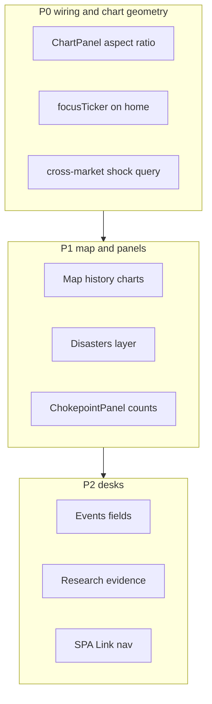

# AAJ Terminal — Final polish plan (post-implementation audit)

**Date:** 2026-09-24  
**Context:** First implementation pass landed (hooks, OHLC backend, full-bleed shell, map layers partial, icons). This document is the **second pass**: proportion, wiring, and “trader desk” feel — especially **squarer, larger price charts** (not banner-stretched full viewport).

**Do not confuse:** edge-to-edge **shell** (use horizontal space for *layout*) ≠ edge-to-edge **chart** (stretch LWC to 100% width × fixed 200px height).

---

## Design principle: chart geometry

| Mode | Target aspect | Width constraint | Height |
|------|---------------|------------------|--------|
| **Home featured** | ~**1.35–1.6 : 1** (squarer than TV) | `max-w-[720px]`–`max-w-4xl` inside 8-col, or 6-col chart + 6-col context | `min(55vh, 480px)` from **width × ratio**, not `38vh` alone |
| **Asset hero** | ~**1.5 : 1** | `max-w-5xl` centered in page **or** 8/12 grid column | `clamp(360px, 50vw × 0.55, 520px)` |
| **Home compact** | Remove or rename | Do **not** use `compact: 200px` on wide columns | Use `variant="featured"` with `aspect-[5/3]` container |
| **Sparklines** | 3:1 (60×20) | unchanged | OK |

**Implementation sketch** (`ChartPanel.tsx`):

```ts
// Container-driven sizing (ResizeObserver on wrapper)
const w = containerWidth;
const h = variant === "featured"
  ? Math.round(Math.min(w * 0.62, 480))  // ~1.6:1
  : Math.round(Math.min(w * 0.55, 520));
assertChartSize(w, h); // mobile → spark fallback per guardrails
```

**CSS:** Parent uses `aspect-[5/3] max-h-[min(55vh,520px)] w-full max-w-4xl` — chart **fills box**, not arbitrary 8-col width.

---

## Page audit summary



---

## `/` Markets cockpit

### What works
- `fetchHome`, `fetchCrossMarket`, `fetchAsset(focusTicker)` wired.
- Movers from live `changePct`; anomaly breakout; icons + `normalizeQuote`.

### What feels wrong (your “stretched stock” feedback)
- Featured chart: **xl:col-span-8 + `compact` 200px** → ~900×200 banner.
- `focusTicker` defaults BRENT; **IndexStrip always navigates away** so featured chart never follows strip clicks on home.
- Watchlist/Movers don’t call `setFocusTicker`.
- Row 3: watchlist **8 col with 4 col empty** on xl.
- Nested `terminal-panel--flush` on chart (double chrome).

### Wiring bugs
| Bug | Fix |
|-----|-----|
| Matrix click uses `focusTicker` only, not cell row | `onCellClick={(c) => navigate(\`/cross-market?shock=${c.row}\`)}` |
| `?shock=` ignored on Cross page | `useSearchParams` in `CrossMarketPage` |
| IndexStrip `{ ...fx, rates }` | Use `{ US10Y: rates }` like Watchlist |
| `["home"]` staleTime mismatch App vs MarketHome | Single `staleTime` in shared hook or constant |

### Layout target (xl)

```text
[ anomaly full bleed ]
[ index strip scroll ]
[ marquee optional ]
┌─────────────────────────────┬──────────────────┐
│ FEATURED CHART max-w-4xl    │ Movers (4 col)   │
│ aspect 5/3, ~480px tall     │                  │
├─────────────────────────────┴──────────────────┤
│ Matrix 8 col          │ Events 4 col         │
├───────────────────────┴──────────────────────┤
│ Watchlist 12 col OR 8 col + secondary 4 col   │
└──────────────────────────────────────────────┘
```

### Interaction model (home)
- **Single click** strip/watchlist row → `setFocusTicker` + highlight row (stay on home).
- **Double-click** or “Open desk →” → `/asset/:ticker`.
- Featured chart shows `isFetching` overlay when switching ticker.

### Backend (sparklines)
- `market_home_service` still quotes-only → synthetic sparks. **Optional:** attach `chart_tail: last 20 closes` per watchlist symbol (batch yfinance, TTL 4h) to kill fake `[p*0.98, p, p*1.005]` curves.

**Files:** `MarketHome.tsx`, `IndexStrip.tsx`, `Watchlist.tsx`, `StockRow.tsx` (optional `onPreviewSelect`), `ChartPanel.tsx`, `market_home_service.py`.

**Acceptance:** At 1440px, featured chart **height ≥ 400px**, width ≤ ~896px; clicking SPX on strip updates chart **without** leaving `/`.

---

## `/asset/:ticker` — Instrument desk

### What works
- OHLC pipeline, candles, hooks fixed, normalize asking, map link for phys.

### What feels wrong
- Chart spans **full page width** → wide shallow pane.
- Single scroll column; no sticky tape.

### Layout target
- **Tape row** sticky under header: icon, ticker, price, Δ%, stale, map link.
- **Chart block:** `grid grid-cols-12`; chart `col-span-12 lg:col-span-8 lg:max-w-5xl` with squarer aspect (above).
- Verdict + diverging bar beside chart on lg (`col-span-4`) or below on mobile.
- Trends/news unchanged but tighter vertical rhythm.

**Files:** `AssetPage.tsx`, `ChartPanel.tsx`.

**Acceptance:** Chart box at 1440px ≈ **800×480** feel, not 1400×340.

---

## `/map` — Flagship

### What works
- Full viewport height, WS + REST, weather/eq dots, geo layers, controlled viewState.

### Wiring / bugs
| Issue | Severity | Fix |
|-------|----------|-----|
| **Disasters** fetched, not drawn | P1 | `DeckOverlay` scatter from `alerts` geocode or RSS lat/lon parse in `layers.py` |
| **Trails** not in LayerToggles | P2 | Add `trails` toggle; gate headings PathLayer on `ais` |
| **ChokepointPanel** `counts` objects → Sparkline | P1 | `normalizeHistoryCounts(hist)` → `number[]` |
| **CrossingsChart** guardrail 240px blocks h84 LWC | P1 | `assertChartSize` bypass for `variant="mini"` or CSS bars only |
| **WS meta** not in panel | P2 | Pass `meta` from `useMapWS` or poll `fetchMapBox` into panel counts |
| Layer toggles vs NavControl overlap | P2 | Move toggles `bottom-24` or nav `bottom-left` |
| Invalid `?choke=` silent fallback | P2 | Redirect to first box + toast |

**Files:** `DeckOverlay.tsx`, `ChokepointPanel.tsx`, `CrossingsChart.tsx`, `LayerToggles.tsx`, `WorldMapPage.tsx`, `MapView.tsx`, `layers.py`.

**Acceptance:** Earthquakes + weather visible; drawer crossings chart shows bars (not empty); choke tab updates counts within 2s of WS live.

---

## `/cross-market`

### Wiring
- Simulate debounced 150ms ✓; map links on exposed chokepoints ✓.
- **`?shock=` from CommandPalette / home matrix** ✗ → parse on mount, `setShockAsset`, `doSimulate(10)`.
- No initial simulate → treemap empty until slider move.

### Layout
- Heatmap `min-h-[calc(100vh-52px-12rem)]` in grid with treemap **side-by-side** xl 7+5.
- Remove debug copy; shock asset chips include SPX/GOLD optional.

**Files:** `CrossMarketPage.tsx`, `CommandPalette.tsx`.

---

## `/events`

### Wiring gaps
- Hardcoded query; no `?q=` from home links (only title in query string — OK if read).
- Backend: `what_people_are_asking`, `evidence`, `count`, lat/lon unused.
- **Loading:** empty state shows “Seed · Stale” while fetching — add `isLoading` skeleton.
- Chokepoint tags → `/map?choke=` links.
- Sticky `top-[64px]` → **`top-[52px]`**.

**Files:** `EventsPage.tsx`, optional `ChainDrawer.tsx` extract.

---

## `/research`

### Wiring gaps
- Route `/research/:sessionId` **ignored** — use `useParams().sessionId` || `?session=`.
- `ResourcesPanel.tsx` **not used** — replace inline right column.
- Backend WS/POST **no `evidence[]`** — extend `stream.py` or keep trace synthesis but document.
- `useResearchWS` stale `status` in `onclose` — fix deps / ref for `done` state.
- Nav `<a href>` full reload — **`Link`** in `App.jsx`.

**Files:** `ResearchDesk.tsx`, `useResearchWS.ts`, `research_desk/stream.py`, `App.jsx`.

---

## Global / shell

| Item | Action |
|------|--------|
| SPA navigation | `react-router-dom` `Link` for header + in-app CTAs |
| Query client keys | Align `["home"]` options between `App.jsx` and `MarketHome` |
| `queries.ts` | Export `fetchSimulate`, `postResearchRun` |
| FaviconImg | `onError` + hostname extract (parity with AssetIcon) |
| Mobile 380 | ChartPanel respects `assertChartSize` → placeholder below 520w |
| E2E | Playwright: home featured chart bbox aspect; map layer toggle; asset no #310 |

---

## Execution order (subagents)

| Agent | Scope | Est |
|-------|--------|-----|
| **A — Chart geometry** | `ChartPanel`, `MarketHome` featured layout, `AssetPage` chart column | ½ day |
| **B — Home interaction** | focusTicker, strip/watchlist click model, matrix→cross shock | ½ day |
| **C — Map panel** | history normalize, CrossingsChart, disasters layer, WS meta | 1 day |
| **D — Secondary desks** | Cross params, Events loading+links, Research session+ResourcesPanel | ½ day |
| **E — Shell + backend tails** | Link nav, market_home spark tails, research evidence | ½ day |
| **Lead** | Visual pass 1920/380, `npm test`, `./run.sh --prod` smoke | ¼ day |

---

## Success criteria (judge demo)

1. **Home:** Featured chart looks **large and squarish**; strip click updates chart on `/` without navigation.
2. **Asset:** Chart is hero-sized but **not full monitor width**; candles render for BRENT/SPX.
3. **Map:** Toggles show dots; drawer history chart not blank; full viewport map.
4. **Cross:** `?shock=WTI` from palette works; heatmap fills height.
5. **No** false stale on Events load; **no** full page reload on nav clicks.
6. All pages: tiles have **purposeful** col spans — no 8-col watchlist + 4-col void.

---

## Out of scope (third pass)

- Chart range pills 1W/1M/3M (needs API `range` param).
- `market_home` full chart tails for all 12 symbols (quota).
- Scenegraph vessels / TripsLayer animation.
- Full GDACS geocoding pipeline.

---

*This plan supersedes layout assumptions in the first polish pass where “full width” was applied to chart containers. Keep **shell** full width; constrain **chart** boxes.*
