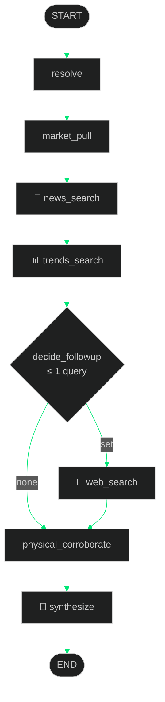
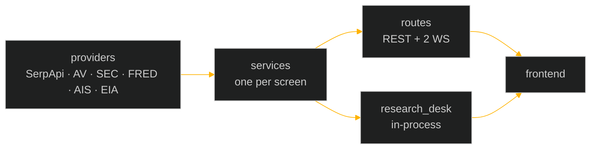

<div align="center">

```
◢◣◢◣◢◣◢◣◢◣◢◣◢◣◢◣◢◣◢◣◢◣◢◣◢◣◢◣◢◣◢◣◢◣◢◣◢◣◢◣◢◣◢◣◢◣◢◣◢◣◢◣◢◣◢◣
```

```text
    _    _    _     ____  _____ ____  __  __ ___ _   _    _    _
   / \  / \  / |   | __ )| ____|  _ \|  \/  |_ _| \ | |  / \  | |
  / _ \ _____| |   |  _ \|  _| | |_) | |\/| || ||  \| | / _ \ | |
 / ___ \_____  |   | |_) | |___|  _ <| |  | || || |\  |/ ___ \| |___
/_/   \_\  |_|    |____/|_____|_| \_\_|  |_|___|_| \_/_/   \_\_____|

   ▓▓▓  THE MARKET TERMINAL THEY CHARGE $30,000/YEAR FOR  ▓▓▓
   ▓▓▓  WE BUILT IT FREE.                                 ▓▓▓
```

[](https://git.io/typing-svg)

<p>
  
  
  
  
</p>
<p>
  
  
  
  
</p>
<p>
  
</p>

**SerpApi India Hackathon 2026** · Commerce & Market Intelligence · 3 humans · 0 dollars in data bills

[⚡ spine](#-01--demo-spine) · [🗺️ map](#-03--world-map) · [🤖 agent](#-04--research-desk) · [🔌 serpapi](#-05--serpapi) · [🚀 boot](#-06--boot-sequence)

</div>

```text
$ aaj boot --demo

[ ok ] serpapi ............ 4 engines armed (news · trends · search · autocomplete)
[ ok ] markets ............ quotes · fundamentals · filings · macro online
[ ok ] aistream ........... 5 chokepoints locked · baselines warming
[ ok ] research_desk ...... 7 stages · 1 branch · 2 LLM calls · bounded
[ ok ] trace_panel ........ visible. every call. every timestamp.
[ ok ] mock_mode .......... quota-free recording ready

▸ TERMINAL ONLINE — welcome, trader. Type WHY OIL? to begin.
```

```
◆ ━━━━━━━━━━━━━━━━━━━━━━━━ 01 // DEMO SPINE ━━━━━━━━━━━━━━━━━━━━━━━━ ◆
```

<div align="center">



```mermaid
%%{init: {'theme': 'dark', 'themeVariables': {'primaryColor': '#00E676', 'primaryTextColor': '#fff', 'lineColor': '#00B0FF', 'tertiaryColor': '#121212'}}}%%
flowchart LR
    classDef hot fill:#ff3860,stroke:#ff3860,color:#fff
    classDef neon fill:#00E676,stroke:#00E676,color:#000
    classDef ice fill:#00B0FF,stroke:#00B0FF,color:#000
    classDef gold fill:#FFB300,stroke:#FFB300,color:#000
    A[🛢️ Brent spikes]:::hot --> B[🚨 Home flags it<br/>anomaly strip]:::gold
    B --> C[⚖️ VERDICT<br/>physical vs narrative]:::neon
    C --> D[🔍 WHY IS THIS<br/>MOVING?]:::ice
    D --> E[🤖 agent runs<br/>trace LIVE]:::neon
    E --> F[🗺️ worst chokepoint<br/>vs 7d baseline]:::ice
    F --> G[🕸️ exposures<br/>light up]:::gold
    G --> H[📜 cited report<br/>claim → source]:::neon
```

*If a feature doesn't serve this spine, it's cut. Ruthlessly. → [`final_mvp.md`](final_mvp.md)*

</div>

```
◆ ━━━━━━━━━━━━━━━━━━━━━━━━ 02 // THE VERDICT ━━━━━━━━━━━━━━━━━━━━━━━━ ◆
```

> Bloomberg tells you **WHAT** moved. **AAJ tells you whether the move is REAL — before the news finishes writing the story.**

```text
╭─────────────┬──────────┬──────────────────────────────────────────────╮
│   SIGNAL    │  DELTA   │                   SOURCE                     │
├─────────────┼──────────┼──────────────────────────────────────────────┤
│  ❖ PRICE    │  +5.4%   │  markets · Alpha Vantage / yfinance (free)   │
│  ◉ ATTENTION│  +31%    │  pre-narrative search · SerpApi Trends       │
│  ▲ PHYSICAL │  +18%    │  ship traffic vs 7d baseline · AIS (free)    │
├─────────────┴──────────┴──────────────────────────────────────────────┤
│  VERDICT: ✅ MOVE SUPPORTED BY PHYSICAL + NARRATIVE SIGNALS            │
│           analytic output — not an LLM opinion                         │
╰──────────────────────────────────────────────────────────────────────╯
```

*That verdict is the moat. Everything in this repo exists to **produce it, prove it, and let you investigate it.***

```
◆ ━━━━━━━━━━━━━━━━━━━━━━━━ 03 // WORLD MAP ━━━━━━━━━━━━━━━━━━━━━━━━ ◆
```

<div align="center">

**5 LIVE chokepoints · comet trails · trade arcs · event overlay · crossings chart**

`HORMUZ` · `BAB-EL-MANDEB` · `SUEZ` · `MALACCA` · `PANAMA`

</div>

```text
  AISStream ── 1 conn · 5 boxes ──▶ dedup ──▶ batch ──▶ SQLite baselines
     │                                                              │
     │                     MapLibre + deck.gl ◀──────────────────────┘
     │                     dots + glow + trails + stubs + arcs
     ▼
  per-box seed fallback ──▶ socket dies mid-demo? map still renders.
```

* **One connection, five boxes.** Per-MMSI dedup · 500ms–3s batched diffs · per-chokepoint 7-day baselines · seed fallback (`stale:true`, never empty).
* **Canvas, never DOM markers.** `ScatterplotLayer` + `TripsLayer` + `PathLayer` + `ArcLayer` · viewport culling · dead-reckoning between pings.
* **Static geo pre-ingested, committed.** Ports · routes · TSS lanes live in the repo — panning never touches a live provider.

<!-- 🎬 docs/demo.mp4 + screenshots land here — record with MOCK_MODE=true -->

```
◆ ━━━━━━━━━━━━━━━━━━━━━━━━ 04 // RESEARCH DESK ━━━━━━━━━━━━━━━━━━━━━━━━ ◆
```

Forked from `langchain-ai/open_deep_research` · repointed at **SerpApi + DeepSeek** · fixed pipeline · **exactly one** agentic branch · 2 LLM calls · 15s timeouts, skip-and-continue. Hermes retired.

<div align="center">



*Full spec → [`agentic_implementation_plan.md`](agentic_implementation_plan.md) · post-MVP Terminal Pilot → [`FUTURE_PROSPECT.md`](FUTURE_PROSPECT.md) ⛔ not in build*

</div>

```
◆ ━━━━━━━━━━━━━━━━━━━━━━━━ 05 // SERPAPI ━━━━━━━━━━━━━━━━━━━━━━━━ ◆
```

<div align="center">

**Load-bearing. Not decorative. The trace panel proves it live.**

</div>

| Engine | Mission | Why SerpApi (irreplaceable) |
|---|---|---|
| 📰 `google_news` | Catalyst discovery · event timeline | Only live narrative wire — AV has no news depth |
| 📊 `google_trends` | Attention · rising queries · geo spikes | No free API gives pre-narrative search interest |
| 🔎 `google_search` | Agent research · edge discovery | Finds supplier context no structured source has |
| ⌨️ `google_autocomplete` | "What people are asking" panel | Raw emerging questions · 10 calls/mo · most legible demo feature |

`cache-first` · `key-rotation pool` · `warm cache before recording` · **`MOCK_MODE=true` → video with zero quota burn**. 250 free searches/mo is a budget, not a blocker.

```
◆ ━━━━━━━━━━━━━━━━━━━━━━━━ 06 // BOOT SEQUENCE ━━━━━━━━━━━━━━━━━━━━━━━━ ◆
```

```bash
python -m venv .venv && source .venv/bin/activate
pip install fastapi uvicorn requests yfinance edgartools myeia langgraph langchain-deepseek
cp .env.example .env   # SERPAPI_KEY_1..N · ALPHAVANTAGE_API_KEY · FRED_API_KEY
                       # AISSTREAM_API_KEY · EIA_API_KEY? · SEC_USER_AGENT · DEEPSEEK_API_KEY
uvicorn backend.main:app --host 0.0.0.0 --port $PORT
python scripts/warm_cache.py   # pre-fill cache + baselines before demo/recording
```

<div align="center">



</div>

| 📄 Doc | 🧭 Purpose |
|---|---|
| [`TEAM_START_HERE.md`](TEAM_START_HERE.md) | Task board · Day 2 / 6 / 10–12 checkpoints |
| [`api_implementation_plan.md`](api_implementation_plan.md) | Backend spine — nothing hardcoded, curated JSON is law |
| [`apis_aaj.md`](apis_aaj.md) | Full 38-source universe (reference) |
| [`FUTURE_PROSPECT.md`](FUTURE_PROSPECT.md) | ⛔ Post-MVP Terminal Pilot — do not build yet |

<details>
<summary><b>⌨️ palette cheat-sheet</b></summary>

```text
AAPL ............ asset intel          BRENT ........... commodity verdict
WHY OIL? ........ deep investigate     HORMUZ .......... fly map to box
OIL → AIRLINES .. exposure path        INDIA TODAY ..... macro lens
WHAT CHANGED? ... overnight diff       SHOW ANOMALIES .. strip focus
```

</details>

```
◆ ━━━━━━━━━━━━━━━━━━━━━━━━ 07 // WHY THIS WINS ━━━━━━━━━━━━━━━━━━━━━━━━ ◆
```

<div align="center">

| Criterion | Our answer |
|---|---|
| 💡 Idea | Physical-world → market causality, not a dashboard with a chatbot button |
| 🧬 Originality | Physical-vs-Narrative verdict + pre-narrative attention signals |
| 🛠️ Complexity | Multi-provider adapters · 5-box live anomaly detection · bounded agent, streamed |
| 🔧 Usefulness | Every number checkable · every AI claim cited · every shock scenario-runnable |
| 🔌 SerpApi | News + trends + search + autocomplete — load-bearing, visible live |

```text
▓▓▓▓▓▓▓▓▓▓▓▓▓▓▓▓▓▓▓▓▓▓▓▓▓▓▓▓▓▓▓▓▓▓▓▓▓▓▓▓▓▓▓▓▓▓▓▓▓▓▓▓▓▓▓▓
▓  MARKETS MOVE BECAUSE THE WORLD MOVES FIRST.                    ▓
▓  NOW YOU CAN WATCH BOTH — FREE.                                 ▓
▓▓▓▓▓▓▓▓▓▓▓▓▓▓▓▓▓▓▓▓▓▓▓▓▓▓▓▓▓▓▓▓▓▓▓▓▓▓▓▓▓▓▓▓▓▓▓▓▓▓▓▓▓▓▓▓

⭐ star the repo · 🎬 demo drops soon · ◢◣ trade safe ◢◣
```

</div>
