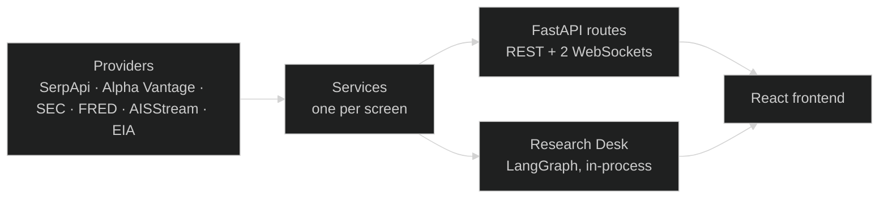
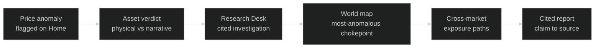
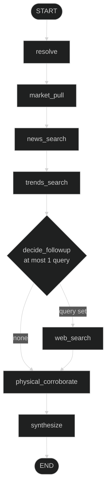

<div align="center">

# AAJ Terminal

**Physical-world intelligence for financial markets — watch the world move, then watch the market follow.**

[](https://git.io/typing-svg)

[](requirements.txt)
[](frontend/package.json)
[](backend/main.py)
[](frontend/package.json)
[](research_desk/graph.py)
[](apis_aaj.md)
[](#license)


*SerpApi India Hackathon 2026 · Commerce & Market Intelligence*

**[Quick Start](#quick-start) · [See It Work](#see-it-work) · [Agent](#the-research-desk-agent) · [Live Map](#live-world-map) · [SerpApi](#serpapi-integration) · [Docs](#documentation)**

<!-- Demo: record with MOCK_MODE=true, save as docs/demo.gif, then uncomment:
<div align="center">
  
</div>
-->

</div>

---

Bloomberg tells you **what** moved. AAJ Terminal tells you **whether the move is real** — by checking the physical world before the narrative finishes writing itself.

```text
Price +5.4%  ·  Search attention +31%  ·  Ship traffic +18% vs 7-day baseline
VERDICT: Move supported by physical and narrative signals — analytic output, not opinion.
```

Every number carries its source. Every AI claim links to evidence. Every shock is scenario-runnable.

## See It Work

Thirty seconds in the terminal — one question, eight traced stages, one verdict:

```text
$ WHY OIL?

  resolve .............. Brent crude · WTI · XLE
  market_pull .......... price +5.4% · volume 2.1x the 20-day average
  news_search .......... 10 articles · Hormuz transit warning (SerpApi)
  trends_search ........ attention +31% · "hormuz oil" rising (SerpApi)
  decide_followup ...... 1 query: hormuz tanker traffic today
  web_search ........... 5 results · AIS reports, port advisories
  physical_corroborate . Hormuz crossings +18% vs 7-day baseline
  synthesize ........... cited report · 12 evidence links

  VERDICT: MOVE SUPPORTED — physical traffic and narrative agree.
```

| Signal | Delta | Source |
|--------|-------|--------|
| Price | +5.4% | Alpha Vantage / yfinance |
| Attention | +31% | Pre-narrative search interest via SerpApi Trends |
| Physical | +18% | Ship crossings vs 7-day baseline via AISStream |

<details>
<summary>Command palette cheat-sheet</summary>

```text
AAPL ............ asset intel          BRENT ........... commodity verdict
WHY OIL? ........ deep investigate     HORMUZ .......... fly map to chokepoint
OIL → AIRLINES .. exposure path        WHAT CHANGED? ... overnight diff
SHOW ANOMALIES .. strip focus          INDIA TODAY ..... macro lens
```

</details>

## Contents

- [Quick Start](#quick-start)
- [See It Work](#see-it-work)
- [How It Works](#how-it-works)
- [The Research Desk Agent](#the-research-desk-agent)
- [Live World Map](#live-world-map)
- [SerpApi Integration](#serpapi-integration)
- [Tech Stack](#tech-stack)
- [Configuration](#configuration)
- [API Reference](#api-reference)
- [Project Structure](#project-structure)
- [Documentation](#documentation)
- [Contributing](#contributing)
- [License](#license)

## Quick Start

One command builds the frontend, starts the backend, and runs health checks:

```bash
chmod +x run.sh && ./run.sh --prod
```

Then open **http://localhost:8000** (API docs at `/docs`).

| Mode | Command | URL |
|------|---------|-----|
| Production (recommended) | `./run.sh --prod` | `http://localhost:8000` — single server |
| Development | `./run.sh --dev` | `http://localhost:5173` — hot reload, proxied to `:8000` |

Prerequisites: Python ≥ 3.11, Node ≥ 20.18, `uv` (backend deps install via `uv pip` with live progress). Ports `8000` (and `5173` in dev) must be free. Full run guide: [`README_RUN.md`](README_RUN.md).

## How It Works



The demo spine — if a feature does not serve it, it is cut ([`final_mvp.md`](final_mvp.md)):



## The Research Desk Agent

A bounded LangGraph agent (adapted from `langchain-ai/open_deep_research`, repointed at SerpApi + Groq) that investigates any market question and streams its reasoning live to a trace panel. Fixed pipeline, exactly one conditional branch, two LLM calls:



| Property | Value |
|----------|-------|
| Graph | 8 nodes, 1 conditional edge — [`research_desk/graph.py`](research_desk/graph.py) |
| LLM calls | 2 per run: `decide_followup` (temperature 0, strict JSON) and `synthesize` (temperature 0.2) |
| Model | Groq `qwen/qwen3.8-27b` (override via `LLM_MODEL`), DeepSeek legacy fallback |
| Budgets | 10 news + 1 trends + 5 web results; 15 s timeout per node, skip-and-continue |
| Streaming | `WS /ws/research/{session_id}` — per-node stage, query, engine, result count, timestamp |
| Blocking API | `POST /api/research/run` → `{ report, trace, evidence_count }` |

Full agent spec: [`agentic_implementation_plan.md`](agentic_implementation_plan.md).

## Live World Map

Five maritime chokepoints stream live vessel positions over a dark MapLibre + deck.gl canvas:

`HORMUZ` · `BAB-EL-MANDEB` · `SUEZ` · `MALACCA` · `PANAMA`

- **One AISStream connection, five bounding boxes** — per-MMSI dedup, batched diffs, per-chokepoint 7-day SQLite baselines.
- **Canvas rendering** — `ScatterplotLayer` + `TripsLayer` trails + heading stubs + trade arcs, with viewport culling.
- **Degrades honestly** — if the socket dies mid-demo, seed baselines render with a `stale: true` badge. Never an empty map.
- **Live diffs** — `WS /ws/map/{chokepoint_id}` pushes a snapshot then ~2/sec updates.

Static geography (ports, routes, traffic-separation lanes) is pre-ingested and committed, so panning never touches a live provider.

## SerpApi Integration

SerpApi is load-bearing infrastructure, not decoration — the trace panel proves each call live:

| Engine | Role | Why SerpApi |
|--------|------|-------------|
| `google_news` | Catalyst discovery, event timeline | The only live narrative wire with depth |
| `google_trends` | Pre-narrative attention, rising queries, geo spikes | No free API exposes search interest |
| `google_search` | Agentic research, supplier and edge discovery | Context no structured source carries |
| `google_autocomplete` | "What people are asking" panel | Raw emerging questions, most legible demo surface |

Quota discipline: cache-first fetching, a `SERPAPI_KEY_1..10` rotation pool, warm cache before recording, and `MOCK_MODE=true` for zero-quota demo replay from cache and seeds.

## Tech Stack

**Backend** — single FastAPI process, no Postgres/Redis/Celery; background work is `asyncio` lifespan tasks.

| Layer | Technology |
|-------|------------|
| API | FastAPI, Uvicorn, SQLite (`chokepoints.db`, cache) |
| Market data | Alpha Vantage (quotes, fundamentals, FX) with yfinance fallback |
| Filings | SEC EDGAR (`edgartools`), 10 req/s fair-access |
| Macro | FRED (rates, CPI), EIA (energy inventories) |
| Live ships | AISStream WebSocket, single multiplexed connection |
| Config | `pydantic`-style env via `backend/config.py`, `python-dotenv` |

**Agent** — LangGraph `StateGraph`, LangChain-Groq, strict-JSON single-follow-up policy, cited synthesis.

**Frontend** — pinned in [`frontend/tech-stack.lock.json`](frontend/tech-stack.lock.json):

| Layer | Technology |
|-------|------------|
| Build | Vite 8, `pnpm@9.12.3`, TypeScript 5.7 |
| UI | React 19, React Router 7, Tailwind CSS 4, TanStack Query 5 |
| Map | MapLibre GL 5.5 + deck.gl 9.1 (scatter, trips, path, arc layers) |
| Charts | lightweight-charts 5, d3-scale/array/hierarchy (named imports only) |
| Data fetching | `fetch("/api/…")` + native WebSockets — no mocks in the shipped UI (MSW is test-only) |
| Tests | Vitest + Testing Library, Playwright (socket-kill e2e), bundlesize gates |

## Configuration

```bash
cp .env.example .env   # never commit .env
```

| Variable | Purpose |
|----------|---------|
| `SERPAPI_KEY_1` (`_2.._10` optional) | SerpApi rotation pool |
| `ALPHAVANTAGE_API_KEY` | Quotes, fundamentals, FX (25/day free) |
| `FRED_API_KEY` | Macro series |
| `AISSTREAM_API_KEY` | Live vessel stream |
| `EIA_API_KEY` | Energy inventories / production |
| `SEC_USER_AGENT` | Required contact UA for SEC fair access, e.g. `AAJ demo you@example.com` |
| `LLM_API_KEY` (`GROQ_API_KEY` alias) | Groq key powering the Research Desk |
| `LLM_MODEL` | Override (default `qwen/qwen3.8-27b`, verified live) |
| `MOCK_MODE` | `true` → quota-free replay for recordings |

## API Reference

Selected endpoints (complete reference in [`README_RUN.md`](README_RUN.md)):

```text
GET  /healthz                         → {"ok": true}
GET  /readyz                          → {db_exists, cache_size, ais_task}
GET  /api/market-home                 → indices, FX, rates, commodities, anomaly strip, evidence[]
GET  /api/asset/{ticker}              → quote, chart, fundamentals, filings, news timeline, trends
GET  /api/events                      → clustered catalysts
POST /api/cross-market/simulate       → exposures + exposed chokepoints for a shock
GET  /api/map                         → 5 chokepoints vs 7-day baselines
POST /api/research/run                → {report, trace, evidence_count}
WS   /ws/map/{chokepoint_id}          → live position diffs
WS   /ws/research/{session_id}        → live agent trace
```

## Project Structure

```text
├── backend/            # FastAPI app: api/, services/, providers/, cache/, models/
├── research_desk/      # LangGraph agent: graph.py, state.py, nodes/, tools/, stream.py
├── frontend/           # React 19 + Vite 8 SPA (src/), built to dist/, served at /
├── scripts/            # warm_cache.py (pre-fill cache + baselines), prep_geo.py
├── run.sh              # one-command launcher: deps → build → serve → health checks
├── requirements.txt    # backend deps (uv-installed)
└── *.md                # specs and contracts (see below)
```

## Documentation

| Document | Purpose |
|----------|---------|
| [`README_RUN.md`](README_RUN.md) | Run modes, env setup, endpoints, troubleshooting |
| [`TEAM_START_HERE.md`](TEAM_START_HERE.md) | Task board and day-by-day checkpoints |
| [`final_mvp.md`](final_mvp.md) | MVP scope — the demo spine |
| [`api_implementation_plan.md`](api_implementation_plan.md) | Backend spine and contracts |
| [`agentic_implementation_plan.md`](agentic_implementation_plan.md) | Research Desk agent spec |
| [`FRONTEND_CONTRACT.md`](FRONTEND_CONTRACT.md) | Frozen frontend API contract |
| [`apis_aaj.md`](apis_aaj.md) | Full 38-source data universe (reference) |
| [`FUTURE_PROSPECT.md`](FUTURE_PROSPECT.md) | Post-MVP Terminal Pilot — not in build |

## Contributing

`main` stays demo-clean. Branch as `feat/<task>`, open a PR, squash-merge after one review. Merge gates: the socket-kill map test passes and `MOCK_MODE=true` renders the full flow with zero keys.

## License

Released under the MIT License.
